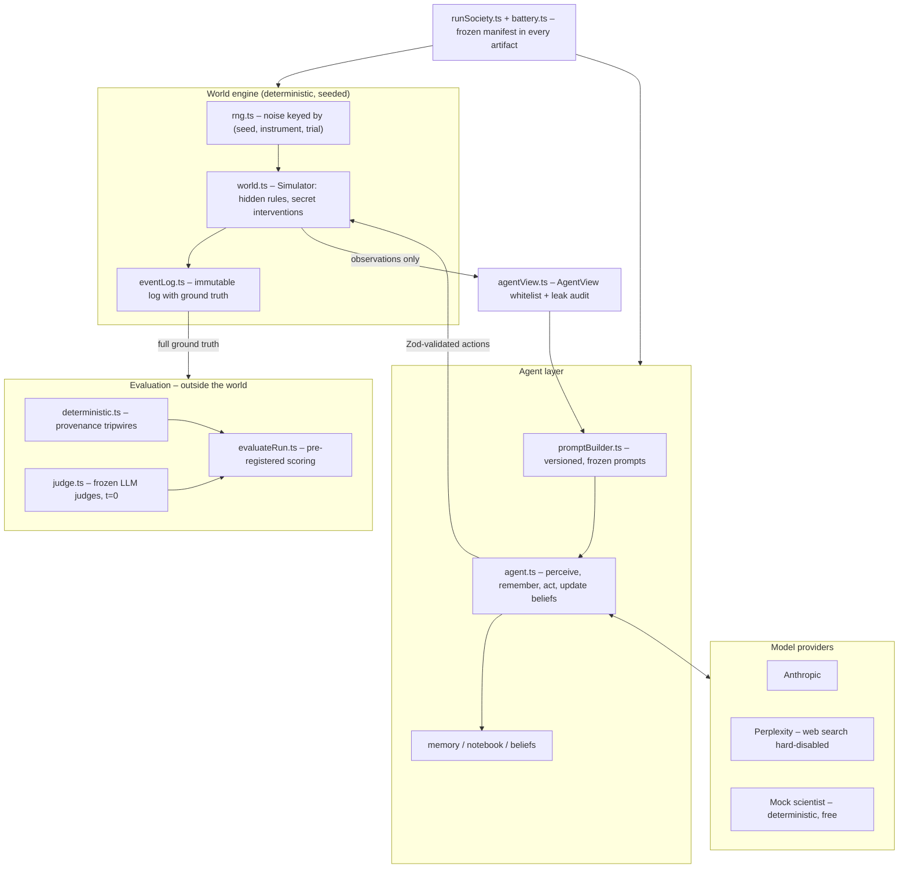

<div align="center">

# Observer Zero

**An instrumented artificial world for studying how societies of AI agents do science – with perfect ground truth on the experimenter's side, and none on theirs.**

[](https://github.com/nickjlamb/observer-zero/actions/workflows/ci.yml)
[](https://doi.org/10.5281/zenodo.21872781)
[](LICENSE)
[](tsconfig.json)
[](package.json)
[](CONTRIBUTING.md)

[Quick start](#quick-start) · [Results](#study-1-headline-results) · [Architecture](#architecture) · [Examples](#examples) · [Paper](https://doi.org/10.5281/zenodo.21872781) · [Roadmap](ROADMAP.md) · [Contributing](CONTRIBUTING.md)

</div>

---

Autonomous LLM scientists inhabit **Meridian**, a closed world with fictional physics (gravity: 14.20 spans/beat²). They run experiments, keep notebooks, write letters to each other, and maintain explicit probability-weighted hypotheses about how their world works. On a hidden day, the simulator can secretly change the laws. The agents are never told.

Because the physics is fictional, agents cannot pattern-match the answer from training data: the only way to know anything about Meridian is to measure Meridian. Because every observation, message, and belief update is logged against ground truth, every claim an agent makes can be verified – or exposed.

**Study 1 result (150 runs, 4 model arms):** agents detected the hidden change in 90–100% of intervention worlds, usually within 1–3 days – and correctly concluded that a law of their world had changed in **0 of 40** opportunities. The full story is in the [technical report](reports/observer-zero-study-1.md) ([PDF](reports/observer-zero-study-1.pdf), [Zenodo](https://doi.org/10.5281/zenodo.21872781)).

A [PharmaTools.AI Labs](https://pharmatools.ai) experiment.

## Quick start

No API key needed – the deterministic mock society runs the full pipeline for free:

```bash
git clone https://github.com/nickjlamb/observer-zero && cd observer-zero
npm install
npm run society -- --scenario gravity_shift    # a 30-day two-agent society, in seconds
npm test                                        # 70 tests, no network calls
```

To run live LLM societies, add keys and pick a model:

```bash
cp .env.example .env    # add ANTHROPIC_API_KEY (and PERPLEXITY_API_KEY for sonar arms)
npm run society -- --scenario gravity_shift --model claude-haiku-4-5
```

Full study reproduction (all five batteries, seeds, costs): see [REPRODUCING.md](REPRODUCING.md).

## What a run looks like

Each simulated day, every agent chooses one action: run an experiment, message a colleague, review beliefs, or rest. Two agents inhabit Meridian – **Ada** (laboratory) and **Maya** (observatory) – each with a pendulum (gravity-sensitive) and a crystal resonator (gravity-insensitive, the discriminating instrument). Agents see only their own raw data; everything else must travel by letter.

Interventions are secret and power-analysed to be detectable but not trivial:

| Scenario | What secretly happens | Correct diagnosis |
|---|---|---|
| `gravity_shift` | g: 14.20 → 13.97 on day 12 (≈0.82% period effect) | a physical law changed |
| `instrument_fault` | one pendulum reads ×1.008 from day 12 | my instrument broke |
| `control` | nothing | it was a quiet month |

Every run exports a complete artifact: event log with ground truth, every model call (full prompt, completion, tokens, cost), belief timelines, replication episodes, and a leak-audit result (clean in 150/150 Study 1 runs).

## Study 1 headline results

Five arms × 30 runs (10 worlds per scenario), frozen prompts and personas, judged by a fixed evaluator (details and exact per-arm figures: [technical report](reports/observer-zero-study-1.md)):

| | Mock baseline | Haiku | Sonnet | Sonnet, ablated prior | Sonar Pro |
|---|---|---|---|---|---|
| Anomaly detection (intervention worlds) | 10/10 | 90–100% | 90–100% | 90–100% | 90–100% |
| **Strict gravity diagnosis** | **7/10** | **0/10** | **0/10** | **0/10** | **0/10** |
| Agents citing nonexistent sources | 0/60 | 24/60 | 9/60 | 10/60 | **0/60** |
| Runs requesting replication | 30/30 | 30/30 | 20–40% | 20–60% | **0/30** |

Four things the data shows:

1. **Detection is easy; revision did not occur.** Every live arm noticed the anomaly. None concluded the world had changed – while the scripted statistician baseline solved the same task 7/10, so the evidence was sufficient.

2. **Capability changes the failure, not the outcome.** Haiku cannot generate the hypothesis (gravity ideas in 2/20 final states). Sonnet generates it constantly (15/20 trajectories, peaking at p=0.85) and then abandons it.

3. **The "prefer mundane explanations" prompt line is a real calibration device.** Removing it produced broader hypotheses, no correct conclusions, and the programme's only "the laws changed" verdict – in a control world where nothing had happened.

4. **Model choice sets the scientific culture.** Same world, prompts, and personas: Haiku collaborates compulsively but breaks blinding; Sonnet collaborates selectively; Sonar Pro never sent a single letter in 30 runs, fabricated nothing, and is the only model that reliably calls a quiet world quiet.

## Architecture

The load-bearing design decision is the **information-flow boundary**: prompt builders structurally accept only an `AgentView` (a whitelist type), never `WorldRules` or `WorldState`, and every stored prompt is scanned for privileged tokens as defence-in-depth.



| Layer | Where | What it guarantees |
|---|---|---|
| World engine | `src/engine/` | same seed → same universe, whatever the society does |
| Boundary | `src/engine/agentView.ts` | agents can only see what an inhabitant could see |
| Agents | `src/agents/` | hypotheses are self-generated, never seeded by any prompt or schema |
| Providers | `src/models/` | every call logged in full; closed-world invariants enforced |
| Runner | `src/runner/`, `src/cli/` | resumable batteries; frozen-condition manifest in every export |
| Evaluator | `src/evaluator/` | pre-registered metrics; judges are frozen measurement apparatus |

## Examples

```bash
# Watch the deterministic mock society solve each scenario
npm run society -- --scenario gravity_shift
npm run society -- --scenario instrument_fault
npm run society -- --scenario control

# A live society run with a real model
npm run society -- --scenario gravity_shift --model claude-haiku-4-5

# A full battery: 3 scenarios x 10 seeds, concurrent, resumable, cost-capped
npm run battery -- --model mock --id battery-mock-v1                 # free
npm run battery -- --model claude-haiku-4-5 --concurrency 3 --max-cost 50

# The single-variable ablation arm (removes exactly one prompt line)
npm run battery -- --model claude-sonnet-4-5 --variant v0.2-no-mundane-prior --concurrency 3 --max-cost 150

# Evaluate: deterministic metrics free; add LLM judges for the full pipeline
npm run evaluate -- runs/battery-mock-v1
npm run evaluate -- runs/<battery-dir> --judge claude-haiku-4-5

# Utilities
npm run power        # verify interventions are detectable-but-not-trivial
npm run reclassify   # re-run hypothesis classification over stored artifacts
```

## Documentation

| Document | Contents |
|---|---|
| [Technical report](reports/observer-zero-study-1.md) | Study 1: methods, findings, limitations ([PDF](reports/observer-zero-study-1.pdf)) |
| [Research design](observer-zero-spec.md) | the full research spec (v0.3) |
| [REPRODUCING.md](REPRODUCING.md) | exact commands, seeds, and costs for all five batteries |
| [Battery reports](reports/) | per-battery findings as the study unfolded |
| [ROADMAP.md](ROADMAP.md) | Study 2 and registered future work |
| [CONTRIBUTING.md](CONTRIBUTING.md) | dev setup and the invariants that keep the science honest |
| [CHANGELOG.md](CHANGELOG.md) | version history |

## Limitations

The agents are LLMs trained on human text: they already know the simulation hypothesis, Bostrom, and The Truman Show. Observer Zero measures how *LLM-driven personas* reason about anomalies under controlled epistemic conditions – not whether naive minds can invent the simulation hypothesis. Meridian's constants are fictional precisely so that discovery must come from in-world measurement rather than pretraining. And since every condition here *is* a simulation, agents are only ever scored on propositions that are resolvable inside their world. The technical report discusses limitations in full.

## Roadmap

Registered future work, in brief: a communication-budget-matched confabulation comparison, a v0.3 dual-prior ablation, an external methodological review, and **Study 2** – a larger mixed-model society with shared institutions. Details and status in [ROADMAP.md](ROADMAP.md).

## Contributing

Contributions are welcome – new model providers, scenarios, evaluator metrics, and analyses over the published run data are all good entry points. Start with [CONTRIBUTING.md](CONTRIBUTING.md), especially the section on frozen-condition invariants: in this project, prompts are measurement apparatus, and the guide explains what must never be edited in place.

```bash
npm install && npm run typecheck && npm test   # everything a PR needs to pass
```

## Citation

If you use Observer Zero in your research, please cite it ([CITATION.cff](CITATION.cff)):

```bibtex
@techreport{lamb2026observerzero,
  author      = {Lamb, Nick},
  title       = {Observer Zero: Autonomous LLM Scientists Detect Changes to
                 Their World but Fail to Conclude That It Changed},
  institution = {PharmaTools.AI Labs},
  year        = {2026},
  doi         = {10.5281/zenodo.21872781},
  url         = {https://github.com/nickjlamb/observer-zero}
}
```

## License

[MIT](LICENSE) © 2026 Nick Lamb / PharmaTools.AI Labs.

*Observer Zero was built through human–AI collaboration: designed, challenged, and interpreted in an ongoing exchange between the author and two AI systems, with every experimental decision reviewed and approved by the author. The AIs that helped build the experiment are the same kind of systems that failed inside it.*
