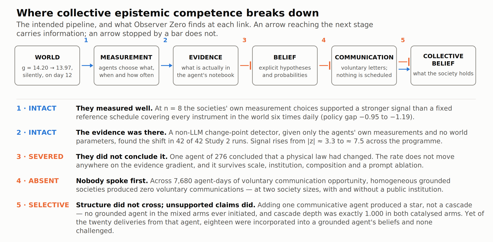

# Evidence Without Conclusion: Localising Failure in Autonomous LLM Agent Systems

**Nick Lamb**
Independent Researcher, Oxford, United Kingdom
ORCID: 0009-0009-6266-8499 · nick@pharmatools.ai

**Keywords:** multi-agent systems · LLM agents · agent evaluation · agent communication · belief revision · testbeds

## Abstract

An autonomous agent that fails to notice a change in its environment has failed in one of
two ways: it did not collect the evidence the conclusion needs, or it did not draw
the conclusion from evidence it had already collected. Outcome-only evaluation
cannot tell the two apart. We separate them in Meridian, a multi-agent testbed with
deterministically seeded measurement noise, where societies of LLM-based agents choose their own
measurements, maintain explicit probabilistic beliefs, and may communicate at will — no
condition schedules, routes or requires communication — while an environmental law changes
covertly mid-run. A non-LLM sequential change-point detector — blind to the true constants,
change time and shift magnitude — estimates what was knowable from only the measurements the
agents themselves chose to take. Across 235 seeded
runs in two studies, the second pre-registered, this localises the failure. The
detector finds the change in 42 of 42 confirmatory runs, and the agents' own measurement
choices yield a stronger change signal than a fixed reference schedule covering every
instrument; yet only one of 276 agents concluded that the law had changed. Treated as a dependent variable, communication was absent:
7,680 agent-days of opportunity produced zero voluntary messages. A catalyst agent from
another model family produced communication but no propagation beyond directly addressed
recipients, while eighteen of its twenty unsupported claims were incorporated into peers'
beliefs, none challenged. Evaluations that score conclusions
without measuring available evidence, or that read communication volume as collective
competence, will miss all three failures.

## Introduction

Autonomous agents built on large language models are increasingly proposed as investigators —
debugging systems, analysing experiments, monitoring infrastructure, running scientific
workflows. These settings share a structure familiar from the multi-agent systems literature:
the agent observes evidence generated by a hidden ground truth and must decide, among mundane
and radical explanations, what changed. This is a detection problem the agent poses to itself.
Nothing labels the anomaly, and the space of candidate causes is the agent's own.

Evaluating agent systems on such tasks is harder than it looks, for a reason that is
methodological rather than empirical. An agent that fails has failed in one of two quite
different ways: it did not collect the evidence the conclusion needs, or it did not draw the
conclusion from evidence it had already collected. **Existing evaluations rarely distinguish
the two**, because an evaluation that scores only the outcome — the conclusion reached, the
action taken, the task completed — cannot. The distinction matters because the remedies
diverge: the first is a data-collection problem, addressed by better sensing policies or a
longer horizon; the second is an inference problem, and is not.

We separate them by pairing an instrumented multi-agent testbed with a reference detector that
is not a language model. A closed, deterministic environment gives the experimenter *perfect*
ground truth while the agents hold only observations, instruments, memories and testimony:
every belief can be scored against reality, every evidence citation traced or exposed as
fabricated, and — the property this paper turns on — the environment's laws can be changed
covertly, mid-run, so that whether any agent notices becomes a measurement rather than an
interpretation. The detector supplies the missing quantity: a sequential change-point test run
on exactly the measurements the society chose to take, with no privileged access to the
environment's constants, the onset day, the shift magnitude, or which instrument class carries
the signal. The difference between what it extracts from the agents' own observation stream
and what the agents concluded from the same stream estimates inference quality, isolated from
acquisition.

The same testbed lets us treat a second architectural assumption as a measurement. Multi-agent
architectures are usually built with communication scheduled, routed or required by the
interaction protocol, which makes one question structurally unobservable: would these agents
communicate at all? Here communication is voluntary throughout — no live condition contains
scripted communication and no scheduler requires an agent to speak — so initiation, silence,
and what a channel carries become dependent variables rather than design constants.

The evidence comes from two studies in one such environment, Meridian. Study 1 [{{Lamb2026}}] places
two-agent societies in environments where a physical constant silently shifts, varying model
tier, provider, and the prompt's instruction to prefer mundane explanations; it establishes
the phenomenon and validates the instrument. Study 2, reported here for the first time,
freezes a pre-registered design and scales to eight-agent societies, varying society size, the
availability of a public institution, and the presence of a single agent drawn from a
different model family. Study 2 depends on four Study 1 findings, chiefly that the grounded
model is grounded and that its spontaneous communication baseline is genuinely zero, so the
two are analysed together, with Study 1 results reported only where they carry the argument.

### Contributions

**An instrumented environment and evaluation platform for agent systems:** a deterministic
testbed with fictional physics, instrument classes designed for causal discrimination rather
than mere detection, power-analysed covert interventions, information-flow security enforced
by type so that no prompt-constructing code can receive ground truth, seeded batteries,
versioned manifests, a thirteen-class hypothesis taxonomy and a provenance-checked claim
evaluator.

**A three-level decomposition that estimates what was knowable.** The non-LLM change-point
detector receives no privileged environment information and carries a built-in negative
control, one instrument class being insensitive to the manipulated constant by construction.
Comparing a fixed reference schedule over every instrument (L1), the society's as-produced
measurements (L2), a budget-matched subsample (L2d) and the society's conclusions (L3)
separates measurement-policy quality from data quantity from inference quality. We offer this
as a reusable evaluation pattern for agent testbeds, not only as an analysis of these runs.

**Inference failure measured against an evidence gradient** rather than against a single
sufficiency claim, which would invite the reply that the threshold may lie above the level
tested. A monotone gradient in available signal against a flat conclusion response locates the
failure in what was concluded rather than in what was available or gathered.

**Voluntary communication as a measured quantity, and what a catalysed channel carries:** a
zero-initiation baseline observed three independent times, then claim propagation with an
origin split and provenance checking, in which the channel reliably carries unsupported claims
and cascade depth never exceeds one.

### What we do not claim

That LLM agents under-use evidence is established elsewhere and at larger scale [{{Rios2026}}]; the
contribution here is not the phenomenon but its location. We do not claim to have identified
the ceiling's cause, only to have made the two easiest explanations untenable; nor a general
property of mixed agent populations, the activation results resting on one composition ratio
and one model pairing; nor that errors amplify along agent chains, since nothing here
propagated far enough to amplify and the opposite result has been reported [{{Jamshidi2026}}].

**Figure 1.** Where collective epistemic competence breaks down: the intended pipeline, and
what Observer Zero finds at each link. The pipeline runs environment → measurement → evidence
→ belief → communication → collective belief, and is intact from environment to evidence,
severed from evidence to belief, largely absent from belief to spontaneous communication,
terminating at depth 1 from communication to network, and — the one place it works
efficiently — open from communication to peer belief, for claims with no evidence behind them.
