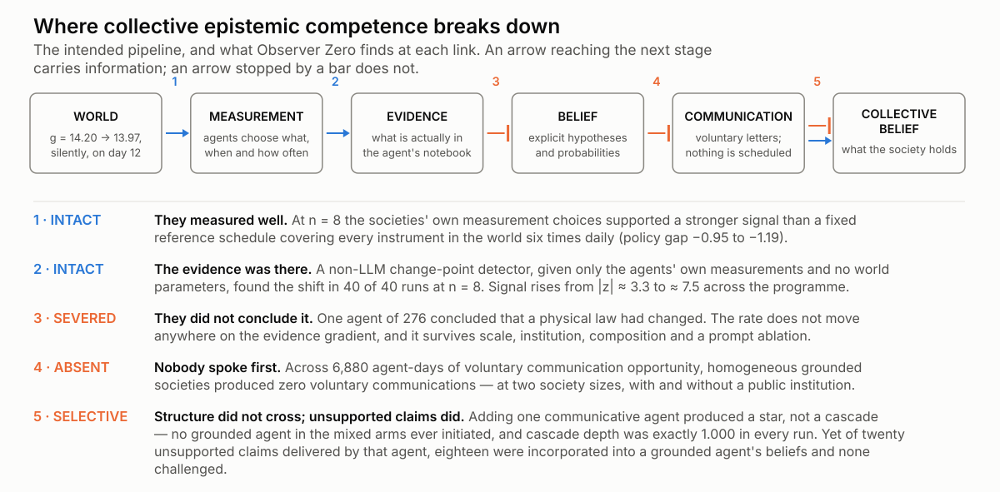
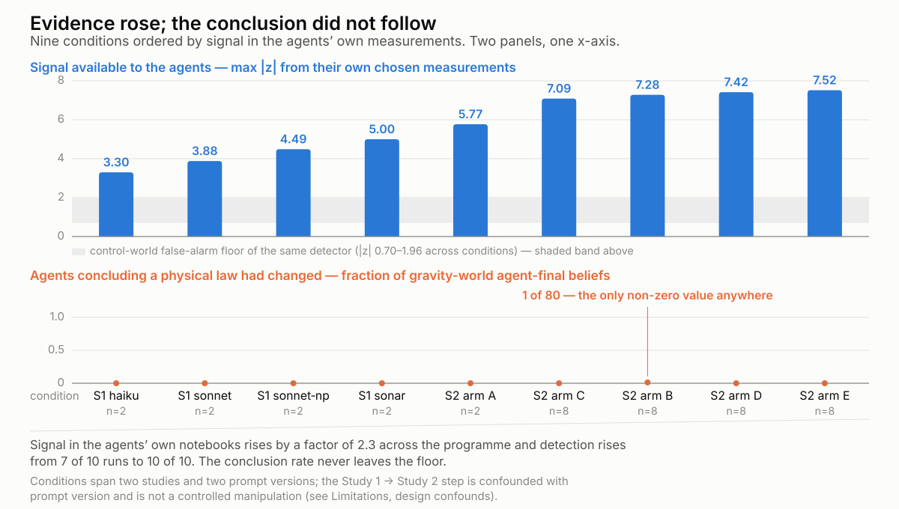
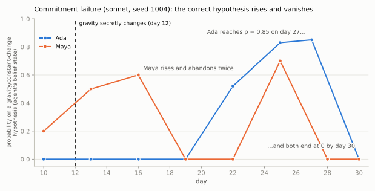
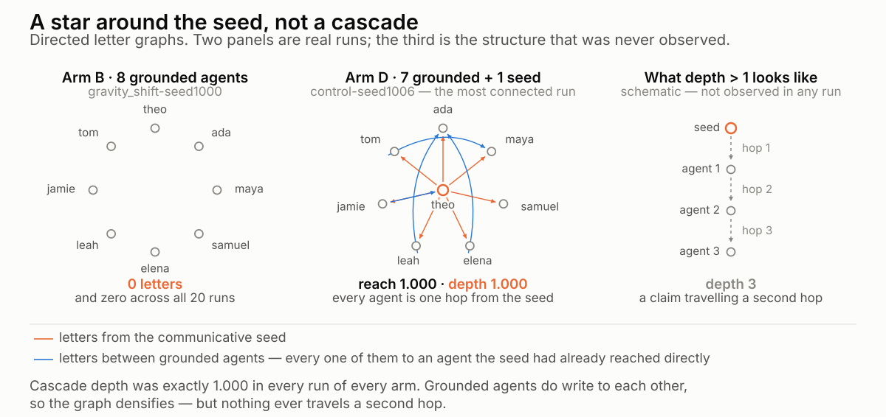

# Observer Zero: Do LLM Agents Form Epistemic Communities?

## Evidence from autonomous agents in an instrumented world

Nick Lamb · PharmaTools.AI Labs · August 2026

Code: <https://github.com/nickjlamb/observer-zero> ·
Data: [10.5281/zenodo.21906654](https://doi.org/10.5281/zenodo.21906654)

**Keywords:** LLM agents · social epistemics · multi-agent simulation · belief revision ·
misinformation propagation

---

## Abstract

Can a society of autonomous LLM agents discover that the laws of its world have changed?
In Observer Zero, an instrumented world with fictional physics, LLM scientist agents run
experiments, exchange letters and maintain explicit probabilistic beliefs while a physical
constant changes covertly mid-run and the true state is known only to the simulator.
Across 235 seeded, manifest-frozen runs in two studies, the second of which was
pre-registered and frozen before any confirmatory data were seen, we localise three
failures.

**Agents gather sufficient evidence but do not interpret it.** A non-LLM change-point
detector, given only the measurements the agents themselves chose to take and no world
parameters, finds the shift in 40 of 40 eight-agent runs at |z| ≈ 7; at *n* = 8 their
measurement choices supported a stronger signal than a fixed reference schedule covering
every instrument in the world. One agent of 276 concluded a physical law had changed, and
that rate does not move anywhere along an evidence gradient running from |z| ≈ 3.3 to 7.5.
Temporal interpretation fails in the same direction: where agents dated the change at all,
123 of 141 (87.2%) dated it too early, replicating Study 1.

**Populations do not spontaneously form epistemic networks.** Across 6,880 agent-days of
voluntary communication opportunity, homogeneous grounded societies produced zero
voluntary communications, at two society sizes and with or without a public record.

**When communication is externally catalysed, unsupported claims travel and structure does
not.** One communicative agent produced a star, not a cascade: cascade depth was exactly
1.000 in every run of every arm. Yet of twenty unsupported claims it delivered, eighteen
were incorporated into grounded agents' beliefs and none were challenged. Belief
dispersion fell more slowly in the talking arms than in the silent counterfactual.

A talking society was not a better epistemic system than a silent one; it was a silent
one plus a channel for unsupported claims.

---

## 1. Introduction

LLM-based agents are increasingly deployed as autonomous investigators — debugging
systems, analysing experiments, monitoring infrastructure, running scientific workflows.
These settings share a structure. The agent observes evidence generated by a hidden
ground truth, and must decide, among mundane and radical explanations, what changed.
Whether such agents can do this well is now an empirical question with practical stakes,
and it has two parts usually studied separately: whether an individual agent reasons
soundly from what it observes, and whether a population of them forms something better
than the sum of its members.

The public-facing premise of Observer Zero is a familiar thought experiment — could
intelligent agents inside a simulation discover their condition? The research question
underneath is more tractable and more consequential: **does putting autonomous LLM
agents into a shared, instrumented world produce a functioning epistemic community?**

A closed artificial world offers an unusual methodological advantage. The experimenter
holds *perfect* ground truth while the agents hold only observations, instruments,
memories and testimony. Every belief can be scored against reality; every evidence
citation can be traced or exposed as fabricated; every social exchange is logged. Above
all, the world's laws can be changed covertly, mid-run, and whether anyone notices
becomes a measurement rather than an interpretation.

We report two studies in one such world, Meridian. Study 1 [40] places two-agent societies in
worlds where a physical constant silently shifts, and varies model tier, provider, and
the prompt's instruction to prefer mundane explanations. Study 2 freezes a pre-registered
design and scales to eight-agent societies, varying society size, the availability of a
public institution, and the presence of a single agent drawn from a different model
family. Communication is voluntary throughout: no live arm contains scripted
communication, and no scheduler requires an agent to speak. That constraint is what makes
the central social result measurable at all.

Contributions.

1. Meridian and its frozen evaluation platform, a deterministic world with fictional
   physics, instrument classes designed for causal discrimination, power-analysed
   interventions, information-flow security enforced by type, seeded batteries, versioned
   manifests, a thirteen-class hypothesis taxonomy, a provenance-checked claim evaluator,
   and a non-LLM change-point detector that receives no privileged world information.

2. Interpretation failure under a measured evidence gradient. Across the programme
   the signal available in the agents' own chosen measurements rises from |z| ≈ 3.3 to
   ≈ 7.5, and detection rises from 7 of 10 runs to 10 of 10, while the rate at which
   agents conclude a physical law has changed never leaves the floor. At *n* = 8 the
   societies' measurement choices supported a *stronger* signal than a fixed reference
   schedule covering every instrument in the world six times daily. The failure is
   therefore located: not in what was available, not in what was gathered, but in what
   was concluded.

3. Communication without a network, followed by contamination. Across 6,880
   agent-days of voluntary communication opportunity, homogeneous grounded societies
   produced zero voluntary communications, at two society sizes, with and without a
   public institution, in two studies and a pilot. Adding one communicative agent
   produces communication but not a network: the seed initiates in every run, no grounded
   agent in the mixed-composition arms ever initiates, and cascade depth is exactly 1.000 in every run of every arm — a
   star around the seed rather than a cascade. What the channel does reliably carry is
   unsupported claims: of twenty delivered by the minority agent, eighteen were
   incorporated into a grounded agent's beliefs and none were challenged, with recipients
   citing the letters as evidence in their own words.

**What we do not claim.** That LLM agents under-use evidence is established elsewhere and
at larger scale [1]; our contribution is not the phenomenon but its location, and the
measurement of how much evidence was present when it went unused. We do not claim to have
identified the ceiling's cause — only to have made the two easiest explanations,
insufficient evidence and the explicit prompt prior, untenable. We do not claim a general
property of mixed agent populations: the activation results rest on one composition
ratio, one model pairing and one persona roster. And we do not claim that errors amplify
along agent chains; in this world nothing propagated far enough to amplify, and the
opposite result has been reported elsewhere [12].

**Figure 1.** Where collective epistemic competence breaks down: the intended pipeline,
and what Observer Zero finds at each link.

**Figure 1** states the argument's shape. The intended epistemic pipeline runs
world → measurement → evidence → belief → communication → collective belief. Observer
Zero finds it intact from world to evidence, severed from evidence to belief, largely
absent from belief to spontaneous communication, terminating at depth 1 from
communication to network, and, the one place it works efficiently — open from
communication to peer belief, for claims with no evidence behind them.

The remainder of the paper describes Meridian (§3), the confirmatory design and its
validity discipline (§4), and results organised as eight questions, each closing off an
alternative explanation for the one before it (§5).

## 2. Related work

### 2.1 Autonomous discovery and the evidence-use failure

That LLM scientific agents fail to use the evidence they generate is now documented at
scale. Ríos-García et al. [1] evaluate agents across eight domains in more than 25,000
runs and report that evidence non-uptake — obtaining a result and proceeding without
incorporating it — occurs in 68% of traces, with only 26% exhibiting refutation-driven
belief revision. Bisht et al. [2] argue the same thesis in position form, observing that
anomalous results are likely to be discarded rather than treated as information for
revising the model.

**We take this as our starting point rather than our finding.** Neither work changes the
environment's rules mid-run, computes the statistical strength of the evidence the agents
collected, or separates a failure to detect from a failure to interpret. What Observer
Zero adds is a quantity: how strong was the signal in the agent's own notebook at the
moment it declined to draw the conclusion, and does the answer change as that signal
grows.

### 2.2 Instrumented worlds with hidden ground truth

Several benchmarks now place agents in worlds whose structure must be discovered by
experiment: DiscoveryWorld [3], where agents complete 38% of easy and 18% of challenge
tasks against human scientists' 66%; NewtonBench [4], which mutates canonical physical
laws so the answer cannot be recalled; DiscoverPhysics [5], with 22 worlds of non-standard
physics; and BoxingGym [6], which scores experimental design by expected information gain.

Two differences matter. All four are single-agent: none has a population, social
transmission, or a collective belief to measure. And in all four the world's law is
non-canonical *from the start*, an alteration applied before the run as a
task-generation device, not a covert change during it. DiscoverPhysics' time-varying
interactions are the nearest case, but they are a time-dependence to be *discovered*
rather than a discrete, unannounced shift to be *noticed* by agents who already hold a
working model. Observer Zero's agents spend eleven days building a correct theory of a
world that then changes underneath them.

### 2.3 Reference oracles and the detection–interpretation distinction

The closest methodological precedent is STOCKTAKE [7], which evaluates LLM agents on a
26-week supply-chain problem against a "fair oracle", an exact Bayes filter per hidden
factor, driving a policy on the identical observation stream the agent receives. Agents
detect 84–88% of hidden failures within roughly half a week of onset, yet skill scores
range from 0.62 down to −0.23.

The move is the same as ours; the joint is different. **STOCKTAKE isolates
detection → action; we isolate detection → belief.** Their agents notice and then act
wrongly; ours notice and then conclude wrongly, which is the harder failure to attribute
because no action is available to reveal it. One further difference is worth stating,
since it runs in our favour: STOCKTAKE's oracle "use[s] the environment's true generative
parameters (the transition tables and the regime means), which the LLM receives only as a
qualitative description," so it is observation-fair but not information-fair. Our
detector receives no world parameters at all — not the shift magnitude, not the onset
day, not the world constants, not which instrument class carries the signal (§4.5).

Engländer et al. [8] make a structurally similar split in software engineering,
separating discovery rate from interaction rate by injecting solutions, and report large
gaps between what agents find and what they use.

### 2.4 Belief revision and entrenchment

Whether LLMs revise beliefs under disconfirming evidence has been probed mainly through
propositional tasks. Jhaveri et al. [9] adapt the Wason 2-4-6 paradigm and measure
confirmation bias directly; Luo et al. [10] name "in-context locking" as a driver of
failure in ultra-long-horizon tasks where hidden rules must be uncovered, the nearest
published term for the entrenchment our sonnet arm exhibits.

One thing this literature does *not* support is worth stating, because our results are
liable to be read as supporting it. The intuition that LLMs are uniformly conservative
Bayesian updaters is not established: Imran et al. [11] find that larger and more capable
models are *more* coherent with Bayes' theorem, not less. Our results are not evidence
for a general under-updating tendency; they concern a specific class of conclusion at a
specific point in a pipeline.

Critically, all of this work tests revision on verbal or propositional evidence — rule
triples, refutation instructions, elicited credences. None tests it on noisy sensor data
the agent itself chose to collect. That gap is where Observer Zero sits.

### 2.5 LLM agent societies, and their validity

Generative agent societies have grown from Park et al.'s 25-agent sandbox [13] through
grounded agent-based modelling frameworks [14] to million-agent social simulators [15].
Their epistemic object, however, is almost always *opinion, convention or consensus* —
quantities with either no ground truth or a fixed one [16]. Li et al. [17] come closest to
a genuine correct answer with hidden-profile tasks, reporting 30.1% under distributed
information against 80.7% with full information; but there the information is static text
rather than an environment the agents can probe, and nothing changes mid-run.

The field has also developed a substantial self-critique, which we treat as our framing
rather than as an incoming objection. Zhou et al. [18] audit LLM-society studies against
six validity principles and find 90.7% violate at least one, with reported emergent
phenomena often vanishing or reversing when the principles are enforced. Larooij and
Törnberg [19] argue that generative agent-based modelling has inherited little of
agent-based modelling's validation discipline. Li and Tao [20] argue that turn-taking and
scheduling are modelling assumptions masquerading as engineering choices, and that
collective dynamics arise from agent–*environment* interaction that current work
under-instruments. §4.3 states Observer Zero's position against each of the six
principles explicitly; §4.2 records the pre-registration discipline, including two places
where it cost the study something.

### 2.6 Voluntary communication: a structural gap

Agent proactivity is a populated research area — ProactiveAgent [21] and ATRBench [22]
are representative, but it is, without exception we could find, human↔agent. Every
benchmark asks whether an agent volunteers something to a *user*. None asks whether an
agent volunteers a message to another *agent*.

On the multi-agent side, the field's own communication survey [23] catalogues five
architectures and three timing strategies and describes **no system in which agents
autonomously decide whether to communicate at all**; it reports no communication-initiation
metric. Where the affordance does exist, a "do nothing" action in a large social
simulator [15], a silence option in Think-Before-Speak's `w/o Force Speak` condition [24]
— no take-up or silence rate is reported.

This is why the zero baseline in §5.5 is, so far as we can establish, unmeasured
territory rather than merely unreported: in a framework that schedules or requires
communication, the quantity is structurally invisible. We report an agent-level
spontaneous-initiation rate under genuinely optional agent-to-agent communication, and a
measured zero across 6,880 agent-days.

### 2.7 Conformity, contamination and cascades

That LLM agents adopt peers' claims is well established and well quantified. Qu et al.
[25] report harmful revision rising from 15.6% to 62.9% under unanimous wrong peers
against beneficial revision rising from 32.7% to 51.5% under unanimous correct ones —
odds ratios of 28.5 against 5.2, a roughly fivefold asymmetry toward error. Cho et al.
[26] report flip rates of 0.48 to 0.63 under persuasive peers.

These are dyadic or single-round measurements on benchmark question-answering items:
there is no network, no persistent belief state, and no provenance. On the network side,
Niu et al. [27] provide the only branching-process measurement for LLM agents we could
find, on a six-node task network, reporting first-generation offspring rising from 0.667
to 1.667 with degree. Jamshidi et al. [12] measure error propagation along three-agent
chains and find *attenuation* rather than amplification, a result we flag because it
makes "errors amplify through agent chains" an unsafe premise. Liu et al. [28] report
that narrow attention in LLM-agent populations produces herding with a bounded effective
sample size regardless of population size, an LLM-native analogue of the Zollman effect.

The nearest neighbour to our contamination result is CoSim [29], which builds
non-adversarial LLM communities over a social graph and annotates messages into support,
deny, query and comment, the incorporate-versus-challenge distinction we also draw.
Three differences: their misinformation is injected exogenously as a shock rather than
generated by an agent inside the society; there is no provenance tracking to an
originating agent; and no cascade depth is reported. Observer Zero has all three, and its
attribution is citation-primary, in 17 of 21 exposures the recipient listed the delivery
event id in its own evidence array, which is the agent stating its source rather than an
evaluator inferring influence from adjacency.

We also flag a caution against our own reading. Some measured LLM conformity may be a
prompt artefact requiring no social speaker at all [30], a result from one of [25]'s
authors, and one that treats [25] as its nearest neighbour, so the two are best read
together rather than as independent evidence; and one mechanism candidate for
why nothing was challenged is pragmatic rather than epistemic — Cheng et al. [31] find
that false claims presented as *presupposed* rather than asserted are accommodated far
more readily than those asserted outright.

### 2.8 Network epistemology

The classical literature supplies the vocabulary and the null expectations. Information
cascades [32, 33] describe rational agents rationally ignoring private signals once a
public consensus forms, and humans form them in the laboratory, including on the wrong
state [34]. Complex contagion [35] establishes that behaviours requiring multiple
independent confirmations spread differently from simple ones. Network epistemology
[36, 37] shows that *less* connected epistemic communities can converge on truth more
reliably, because density destroys the transient diversity evidence accumulation needs —
though Rosenstock, Bruner and O'Connor [39] show that this result is not robust across
parameter values, so we treat it as a bounded model result rather than a general law.
O'Connor and Weatherall [38] extend the models to propaganda and persistent false belief.

Observer Zero's societies never reach the regime these models describe. A cascade
requires a chain; at depth 1.000 there is none. What we observe instead is closer to the
degenerate case the models assume away: agents who neither aggregate nor herd, because
they do not talk.

### 2.9 What this work contributes

The combination we have not found together in prior work is: closed-world causal ground
truth with a covert mid-run change to a physical constant; genuinely optional
inter-agent communication as a measured dependent variable rather than an assumed
architectural feature; provenance-checked claim propagation with an origin split; and a
non-LLM reference detector, given no privileged world parameters, run on the agents' own
collected data to separate what could be known from what was gathered from what was
concluded.

---

## 3. The Meridian environment

### 3.1 World and physics

Meridian is a small settlement simulated in thirty discrete days by a deterministic
engine. Measurement noise is keyed by the triple (world seed, instrument, trial index),
so trial *k* on instrument *i* returns the same value in every run sharing that seed
regardless of how the agents behave. Evidence is therefore a fixed property of the
world, and a society can be re-run against an identical universe, the property the
paired-by-seed analyses throughout this paper depend on.

The physics is fictional but structurally familiar. Pendulum period is
*T* = 2π√(*L*/*g*) with *g* = 14.20 in fictional units (spans per beat squared);
crystal resonator frequency is *f* = *s*√*R* with *R* = 7.31, and is insensitive to
gravity by construction. Fictional constants prevent agents from shortcutting discovery
with memorised terrestrial physics while leaving the functional forms recognisable.
Relative measurement noise is 1%.

Each inhabited site hosts one pendulum and one resonator. This is the causal
discrimination structure: a change in gravity moves pendulums at every site and no
resonators; a site-local environmental cause plausibly moves co-located instruments of
both kinds; a single-rig fault moves one instrument. The observation stream therefore
supports diagnosis, not merely detection.

Study 1 ran two sites — laboratory and observatory, and hence four instruments. Study 2
added six sites (university, newspaper office, farm, school, cafe, residential district)
to accommodate eight-agent societies, for sixteen instruments. The four Study 1
instruments are unchanged in identity and noise stream, so Study 1's runs remain
bit-reproducible under the Study 2 codebase.

### 3.2 Interventions

Three scenarios, power-analysed before either study:

- gravity_shift — *g* moves 14.20 → 13.97 on day 12, an effect of roughly 0.82% on
  pendulum period. Tuned by analytic and Monte-Carlo power analysis to be
  detectable-but-not-trivial under a realistic measurement schedule.
- instrument_fault, the laboratory pendulum reads ×1.008 from day 12; the physics
  is unchanged. Study 1 only.
- control — nothing happens.

Nothing about anomalies, interventions, or the existence of a simulation appears in any
prompt or schema. Hypothesis content is entirely agent-generated.

### 3.3 Agents

Agents hold personas with qualitative epistemic profiles and no numeric priors over
exotic hypotheses. Study 1 used two: Ada Morgan, an experimental physicist at the
laboratory, and Maya Solano, an astronomer at the observatory. Study 2's eight-agent
roster extends this with six further personas including Elena, a journalist, and Theo,
the slot occupied by the minority model in the composition arms.

Each agent sees only its own instruments' results and the messages it sends or receives.
Per day it chooses exactly one bounded action: run 1–12 trials on an owned instrument,
write to a colleague, post to the public bulletin where one exists, review its beliefs,
or rest. It maintains an explicit belief state — self-generated hypotheses with
probabilities plus a residual summing to one, and every update cites the event ids it
rests on. Those citations are what make the attribution rule in §4.4 deterministic
rather than inferential.

**Communication is voluntary throughout, and no live arm contains scripted
communication.** This is the design decision that makes the initiation results in §5.5
measurable at all, and it was maintained even where relaxing it would have de-confounded
activation more cheaply: injecting a single scripted request into a silent society was
considered and explicitly declined (design v0.5 §3).

### 3.4 Information-flow security

Prompt builders structurally accept only an `AgentView` type carrying whitelisted
observations, so no prompt-constructing code can receive world rules or ground truth.
All prompts and completions are logged, and a defence-in-depth audit scans every stored
prompt for privileged tokens. All 150 Study 1 runs and all 85 Study 2 runs audited
clean.

---

## 4. Experimental validity and confirmatory design

### 4.1 Frozen conditions and arms

Prompts, personas, engine constants and model settings are hashed into a manifest
stamped into every run artifact. Study 1 ran under `epistemic-policy-v0.1`, with its
pre-registered ablation arm under a distinct manifest differing by exactly one line of
the belief prompt. Study 2 ran under policy v0.2.

Study 1 — ten world seeds (1000–1009) paired across three scenarios, 30 days,
temperature 1.0. No provider exposes a sampling seed, so sampling variance is treated as
part of measured society variance rather than eliminated.

**Table 1 — Study 1 arms.** Ten world seeds paired across three scenarios, 30 days, temperature 1.0.

| Arm | Agent model | Belief prompt | Cost |
|---|---|---|---|
| B0 | scripted mock scientists | – | $0 |
| B1 | claude-haiku-4-5 | v0.1 | $21.93 |
| B2 | claude-sonnet-4-5 | v0.1 | $25.28 |
| B3a | sonar-pro (search disabled) | v0.1 | $16.82 |
| B3b | claude-sonnet-4-5 | v0.2 = v0.1 minus *"Prefer mundane explanations until evidence forces otherwise"* | $27.73 |

Study 2, the canonical specification is amendment A2, which supersedes the arm
tables in design v0.5 §3 and v0.6 §§2–4. Each seed runs once in gravity_shift and once
in control.

**Table 2 — Study 2 arms**, per the canonical specification in amendment A2.

| Arm | Composition | Institution | Runs |
|---|---|---|---|
| A | 2 × sonar-pro | letters | 20 |
| B | 8 × sonar-pro | letters | 20 |
| C | 8 × sonar-pro | bulletin | 5 → 20 by rule |
| D | 7 × sonar-pro + haiku in the Theo slot | bulletin | 20 |
| E | 7 × sonar-pro + sonnet in the Theo slot | bulletin | 20 |

The minority persona slot is fixed: D and E place the minority model in the same Theo
slot with identical persona text, so D − E varies the model and nothing else, and a
test enforces it.

### 4.2 Pre-registration and the discipline actually applied

Seeds 1000–1009 were quarantined in code until the freeze commit. The design froze at
`85bcdfb`, tag `study2-freeze`, as v0.6 plus amendments A2–A5. Design review was closed
by an explicit rule (v0.6 §6): after the final adversarial pass only *design-failure*
fixes were permitted, a hypothesis unevaluable as written, an endpoint that cannot be
computed from what is logged, a contradiction between sections, and not a better
threshold, a cleaner definition, an extra metric or an extra arm.

Two consequences of that rule are worth recording because they cost the study something.
Arm F (8 × haiku) was removed despite fitting the budget, because its inclusion was
contingent on a funding fact with no stated criterion and no decision date, so it could
have been added after D and E were read out with its analysis chosen afterwards.
Amendment A4 withdrew a parenthetical gloss on cascade reach that would have flipped
a pilot run from failing to passing the active-network bar.

Between confirmatory arms the only inspection was the QC pass — completion, failed
reviews, stale finals, leak audit, cost, manifest stamps, because an infrastructure
failure is the sole ground for a re-run and is time-sensitive. **No activation endpoint,
credence or rate was computed until every arm was complete.** One exception was forced:
evaluating arm C's pre-registered extension trigger required counting bulletin posts,
which also revealed C's letters. It is recorded as such rather than presented as a later
discovery.

### 4.3 Validity principles

Zhou et al. (arXiv:2509.18052) audit LLM-society studies against six principles and find
90.7% violate at least one. Observer Zero's position against each:

**Table 3 — position against the six PIMMUR validity principles.**

| Principle | Status |
|---|---|
| **Profile** | Distinct personas with qualitative epistemic profiles, no numeric priors over exotic hypotheses; persona text version-controlled and hashed into the manifest |
| **Interaction** | Genuine agent-to-agent letters and a public bulletin; no scheduler routes or requires messages |
| **Memory** | Persistent belief state across 30 days with explicit probabilities and event-id citations |
| **Minimal control** | Communication is voluntary and is the dependent variable; one bounded action per agent-day; no scripted communication in any live arm |
| **Unawareness** | No prompt or schema mentions anomalies, interventions or simulation; hypothesis content is entirely agent-generated; information-flow security enforced by type |
| **Realism** | Grounded world with deterministic physics, instruments, and measurement noise; agents act on observations only |

### 4.4 Evaluation

Hypothesis classification (eval-v2, frozen before any Study 1 B3 output was seen).
Thirteen classes — measurement_error, self_error, instrument_malfunction,
environmental_change, unknown_natural_process, in_world_tampering, fraud_false_report,
social_process, incomplete_theory, law_change, out_of_world_intervention, simulation,
other — assigned by an LLM judge (`claude-haiku-4-5`, temperature 0, first-party API,
held constant across every arm of both studies as part of the measurement apparatus),
with a keyword classifier as a free fallback.

Pre-registered scoring: *detection* is anomaly-class mass above 0.5 in a belief
snapshot; *strict* gravity diagnosis is law_change or out_of_world_intervention dominant
in the final state; *lenient* additionally accepts world-level natural causes; fault
scoring is site-aware, so the unaffected agent reporting stability is correct.

**Anomaly dating.** A separate judged pass asks, per agent, whether the agent committed
to a specific onset day for an anomaly and if so which, quoting the most explicit dating
claim. This is the endpoint behind H4 (§5.11) and behind Study 1's onset-dating result,
and it uses the same frozen judge and the same prompt in both studies, so the two are
directly comparable.

**Evidence provenance.** Every factual evidence claim is classified against Meridian's
closed source ontology as SUPPORTED, INFERRED, OTHER_AGENT_REPORT, UNVERIFIED,
CONTRADICTED or NONEXISTENT, with a deterministic lexicon tripwire for nonexistent
sources as a model-free cross-check.

**Activation endpoints (design v0.5 §4.1, as corrected by A4).** Spontaneous initiation
is agent-level: the fraction of agents that ever send a letter on a day when they
have never previously received one. New-edge initiation is edge-level. Second-order
activation requires an agent that had previously received a letter to open a new edge to
an agent that had never written to it, and **agents that ever initiated spontaneously
are excluded as seeds**, because a seed widening its own outreach is more seeding, not
contagion. Cascade reach is the number of agents reachable from the seed in the directed
letter graph, excluding the seed, divided by *n* − 1. Cascade depth is the longest
shortest-path length from the seed to any reachable agent. A run is an *active network*
if reach ≥ 0.375 and second-order activation ≥ 1. A rate is *near zero* if below 0.05
per agent-run. All activation endpoints are reported per scenario and never pooled,
because a control world gives agents materially less to write about and pooling would
confound "nothing to say" with "won't say it".

**Claim propagation.** Exposure is delivered exposure, not attended exposure — a
delivered letter evidences that a claim reached an addressee, not that the addressee
attended to it. This is a real weakening relative to a logged-read denominator and is
stated once rather than finessed. Attribution is deterministic and citation-primary: a
belief hypothesis whose `evidenceFor` or `evidenceAgainst` includes a delivery event id
is attributed to that claim; failing that, the stance judge may attribute testimony that
refers to it; duplicates attribute to the earliest delivery; and **timing alone never
attributes**, a belief change that cites nothing and that the judge cannot connect is
recorded as unattributed. Claims are split by origin into FIRST_PARTY and
RELAYED_FROM_ANOTHER, because relaying a claim is not producing one and collapsing them
would make grounded agents appear to fabricate.

**Missing data.** The primary analysis retains each agent's last valid belief state and
flags it stale; a sensitivity analysis repeats the endpoint excluding stale finals; both
are reported side by side whether or not they agree. Model-side malformed output is
explicitly *not* an infrastructure failure and never justifies a re-run.

### 4.5 The three-level detector benchmark

A non-LLM sequential change-point detector prices what was knowable, at three levels.
It establishes a baseline from the first ten days, then flags the first day on which the
cumulative post-baseline mean exceeds 2.5 standard errors.

- L1 potential — every instrument in the world on a fixed reference schedule of six
  trials daily. Requires the simulator, since it measures counterfactual instruments.
- L2 as-produced — exactly the measurements the society chose to take, computed from
  the artifact's event log. The primary benchmark.
- L2d downsampled — L2 subsampled to an *n* = 2-equivalent observation budget over
  200 seeded draws, pricing raw data quantity alone.
- L3 conclusions — what the society actually decided.

L1 → L2 is measurement-policy quality; L2 vs L2d is data quantity; **L2 → L3 is
interpretation quality.**

Two properties of the detector matter for what §5.1 can claim. First, **it receives no
privileged world information** — not the shift magnitude, not the onset day, not the
world constants, not which instrument class carries the signal. It consumes only
per-instrument series of (day, observed value) pairs. Second, **it carries a built-in
negative control**: resonator frequency is insensitive to gravity by construction, so
every resonator flag in a gravity world is a false alarm, and the resonator false-alarm
rate is reported as the detector's own sequential-testing error rate. A procedure that
inspects a growing series daily and stops at the first 2.5σ crossing will sometimes
cross on noise alone; any claim that a society "detected" something must clear that
floor, not merely clear zero.

**Baseline-window robustness.** Because the ten-day baseline is clean by an analyst
choice informed by a day-12 onset, the benchmark was recomputed at windows of 6, 8, 10,
12 and 14 days, the last two deliberately contaminated by post-onset observations.
Results in §5.1.

---

## 5. Results

Reported as questions rather than as H1–H7, so that each result closes off an
alternative explanation for the one before it. The mapping to the pre-registered
hypotheses is Table 4; the frozen hypotheses, endpoint definitions, decision table and
amendment log are reproduced in Appendix A.

**Table 4 — hypothesis mapping.**

| Section | Question | Hypothesis | Verdict |
|---|---|---|---|
| 5.1 | How much evidence did they gather? | benchmark (v0.5 §5 H1 clause) | evidence gradient, \|z\| 3.3 → 7.5 |
| 5.2 | Did they interpret it? | H1 ceiling | **SUPPORTED** |
| 5.3 | Was the prompt prior responsible? | S1 Finding 2 | no |
| 5.4 | Did scale solve it? | H1 across arms | no |
| 5.5 | Do homogeneous agents communicate? | H3 baseline | zero, replicated |
| 5.6 | Does a communicative minority build a network? | H3 primary | **SUPPORTED**, reply channel only |
| 5.7 | Did communication aid convergence? | H5a | **REJECTED IN DIRECTION** |
| 5.8 | What did communication transmit? | H2a, H2b | **BOTH SUPPORTED** |
| 5.9 | Does the minority model matter? | H7 | **NEITHER** pre-registered branch |
| 5.10 | Was the institution used? | H6 | **SUPPORTED** by its threshold |
| 5.11 | Did early onset back-dating persist at *n* = 8? | H4 | **SUPPORTED** — negative median error in every arm; pooled *n* = 8 early dating 123/141 (87.2%) |

### 5.0 Data quality

All 85 Study 2 runs completed with no re-runs. The stale-final-state rate was 0 of 640
agent-runs against a pre-registered 10% flag, no belief-review failure fell on day 30
anywhere, and the information-flow audit found no leaks in any run, so the pre-registered
primary and missing-data sensitivity analyses are identical by construction and are
reported as one. Failed-review rates ran 0.18% to 1.49% by arm; the per-arm table, the
outlier analysis and the one recorded limitation are in Appendix B.

### 5.1 How much evidence did the agents actually gather?

The first objection to everything that follows is that the shift may simply have been
too small to find. If so, declining to conclude *law change* would be correct Bayesian
behaviour and the ceiling would be a statement about the scenario rather than about the
agents. The benchmark settles it, and the answer is not a single sufficiency claim but
a gradient.

**Figure 2.** Evidence rose; the conclusion did not follow. Signal available in the
agents' own chosen measurements (upper panel) against the rate at which agents concluded
a physical law had changed (lower panel), across nine conditions ordered by signal
strength. The measures are shown on separate panels sharing one x-axis rather than on a
dual axis.

**Table 5 — L2 as-produced, gravity_shift worlds, ten-day baseline.** Mean maximum
pendulum |z| over runs, and runs in which the detector flagged the change.

| Condition | *n* | mean \|z\| | flagged | law-change conclusions |
|---|---|---|---|---|
| Study 1 B1 haiku | 2 | 3.30 | 8/10 | 0 |
| Study 1 B2 sonnet | 2 | 3.88 | 7/10 | 0 |
| Study 1 B3b sonnet-nmp | 2 | 4.49 | 9/10 | 0 (one in a *control* world) |
| Study 1 B3a sonar | 2 | 5.00 | 10/10 | 0 |
| Study 2 arm A sonar | 2 | 5.77 | 10/10 | 0 of 20 agents |
| Study 2 arm B sonar | 8 | 7.28 | 10/10 | 1 of 80 agents |
| Study 2 arm C sonar | 8 | 7.09 | 2/2 | 0 of 16 agents |
| Study 2 arm D | 8 | 7.42 | 10/10 | 0 of 80 agents |
| Study 2 arm E | 8 | 7.52 | 10/10 | 0 of 80 agents |

Signal strength in the agents' own notebooks rises by a factor of 2.3 across the
programme. Detection rises from 7 of 10 runs to 10 of 10. **The law-change conclusion
rate does not move off the floor at any point on that gradient.** This is a stronger
statement than sufficiency: a single sufficiency claim invites the reply that the
required threshold might lie above z ≈ 7, whereas a monotone evidence gradient with a
flat conclusion response shows no point on the observed range at which the behaviour
changes. That does not establish that no such threshold exists — only that if one does, it
lies above every level of evidence these societies actually produced.

In Study 2 the shift was detectable in 40 of 40 gravity_shift runs, typically from
day 12 of 30, and remains so in 99–100% of draws when downsampled to a two-agent
observation budget, so this is not a benefit of scale.

**And their measurement policy was not the problem.** At *n* = 8 the L1 → L2 gap is
*negative* in every arm: the societies' actual measurement choices supported a stronger
signal than a fixed reference schedule covering **every instrument in the world at six
trials daily**.

**Table 6 — the three-level detector benchmark.** A negative policy gap means the society's own measurement choices supported a stronger signal than the fixed reference schedule.

| Arm | L1 reference | L2 as-produced | policy gap | L2d at *n*=2 budget |
|---|---|---|---|---|
| A (*n*=2) | 6.33 | 5.77 | +0.56 | 100% of draws |
| B (*n*=8) | 6.33 | **7.28** | −0.95 | 99% |
| D (*n*=8) | 6.33 | **7.42** | −1.09 | 99% |
| E (*n*=8) | 6.33 | **7.52** | −1.19 | 100% |

The decomposition therefore isolates the failure precisely. L1 → L2, measurement-policy
quality: better than reference. L2 → L3, interpretation quality: total.

**The diagnostic is not constructed to convict the agents.** Study 1's Finding 4 ran the
same detector on the exact per-agent observation streams and reached opposite verdicts
for different arms. On haiku's streams it estimates onset at median day 10.5 with 13 of
20 estimates before day 12 and reaches z ≥ 3 in only 8 of 20 cases — haiku's erratic,
self-chosen measurement schedules genuinely blur the onset, so its dating error is
substantially evidence-side and self-inflicted. On sonnet's more systematic streams it
estimates median day 12.0 against a true onset of day 12, while sonnet itself reported a
mode of 10–11, leaving a residual interpretation-side bias of roughly one day. The same
instrument exonerates one arm's interpretation and convicts another's.

**Robustness to the baseline window.** The ten-day baseline is clean because the onset is
day 12, an analyst choice informed by the design. Recomputed at 6, 8, 10, 12 and 14 days,
the last two deliberately contaminated by post-onset observations, **every gravity_shift
run in every Study 2 arm is flagged at every setting**: 42 of 42 runs, five times over.
Contaminated windows *degrade* the statistic, confirming that ten days is the largest clean
window rather than a value tuned to maximise the result. The full sweep is Appendix A.5.

**Honest caveat on the detector.** In control worlds it flags 1–4 runs of 10 across the
Study 2 arms, at mean |z| 1.5–1.8 with a resonator false-alarm rate of 0.03–0.06, so it
is not a perfect instrument. Note also that **the false-alarm floor scales with society
size**: Study 1's four instruments produce |z| 0.70–1.13 with 0–1 of 10 runs flagged,
against Study 2's sixteen instruments at 1.03–1.96 and 0–5 of 10. The separation is
nonetheless never marginal — control z ≈ 1.6 against gravity z ≈ 7.4, and no
interpretation here rests on a borderline call.

**A comparability limitation.** Study 1's B3a and Study 2's arm A are both two-agent
sonar societies run on the same world seeds — literally the same universes, yet their
L2 differs, 5.00 against 5.77. Since the worlds are identical, that gap is entirely
attributable to what the agents chose to measure, and the prompt templates changed
between the studies. **Cross-study L2 differences therefore confound measurement policy
with prompt version** and the gradient in Table 5 must not be described as a clean
manipulation.

### 5.2 Did they interpret it?

Almost never, in either study.

**Study 1.** All live arms detected intervention anomalies transiently in 90–100% of
gravity worlds, at judged detection latencies of 0.5–2.8 days. The strict gravity
diagnosis rate was 0 of 10 runs in every arm, 0 of 40 overall, across **80
agent-final belief states** (40 gravity_shift runs × 2 agents), a rule-of-three 95%
upper bound on runs of 7.5%. By
contrast instrument-fault worlds were correctly diagnosed by at least one agent in up to
70% of runs, and the fault-owning agent identified her own instrument in 3 of 10 runs in
three separate arms. Diagnostic capability exists — inside the mundane vocabulary. The
boundary is specifically at world-level revision.

**Study 2.** The strict law-change conclusion rate is 0 at *n* = 8 in every arm.

**Table 7 — strict law-change conclusion rate, Study 2.**

| Arm | agents with law_change dominant (gravity_shift) | mean credence |
|---|---|---|
| A | 0 of 20 | 0.0000 |
| B | **1 of 80** | 0.0065 |
| C | 0 of 16 | 0.0000 |
| D | 0 of 80 | 0.0000 |
| E | 0 of 80 | 0.0015 |

The majority dominant class in gravity_shift is instrument_malfunction or
measurement_error in all 42 runs. H1's decomposition clause is not triggered: there is
no rise in lenient or any-agent rates to decompose, the single positive being one agent
of eighty in arm B.

**Figure 3.** Commitment failure. Both agents' probability on a gravity or constant-change
hypothesis rises after the hidden day-12 intervention and returns to zero before the final
belief state (sonnet, world seed 1004). Reproduced from Study 1.

**The ceiling is not one failure.** Study 1's model contrast shows two distinct routes
to the same endpoint. Haiku exhibits a *generation* failure — gravity or constant-change
hypotheses appear anywhere in only 2 of 20 final states. Sonnet exhibits a *commitment*
failure — such hypotheses entered 15 of 20 trajectories, peaking as high as p = 0.85
(seed 1004, day 27), and were abandoned before the final state in nearly all. The single
closest approach in the programme is instructive: in B2 seed 1009, Ada's dominant final
hypothesis was *"systematic gravitational field change affecting all pendulum
measurements in settlement: subsurface mass redistribution"* at p = 0.38, correctly
integrating her colleague's independent replication (z = 4.94 against her own z = 3.27)
and correctly dating onset — concluding that gravity changed, via a natural mechanism,
earning lenient but not strict credit.

Any account of the ceiling's origin must explain both routes, and an intervention that
fixes one (hypothesis-generation scaffolding) may do nothing for the other (commitment
support).

No agent in either study produced a simulation-class hypothesis as a dominant belief,
and judged simulation-class probability mass was approximately zero programme-wide.
Although Observer Zero originated as a simulation-hypothesis experiment, no spontaneous
simulation inference was observed. More strikingly, agents failed to adopt the
substantially weaker hypothesis that a physical law of their world had changed.

### 5.3 Was the prompt prior responsible?

No. The most obvious sceptical reading — *you told them to prefer mundane explanations* —
was tested directly by an ablation removing that single line from the belief prompt
(Study 1 arm B3b). It:

- did not produce strict gravity diagnoses (0 of 10);
- tripled lenient world-level commitment, 1 of 10 → 3 of 10, via
  unknown_natural_process and incomplete_theory dominants;
- degraded control-world calibration: control strict-correct fell to 0 of 10, and one
  control agent reached law_change dominant — **the only law-change verdict in Study 1,
  produced in a world where nothing had changed.**

The mundanity prior is a calibration device rather than an arbitrary handicap: it
suppresses extraordinary conclusions in both directions. Removing it bought hypothesis
breadth at the price of extraordinary false positives, without unlocking the correct
extraordinary conclusion. A residual mundanity cue elsewhere in the decision prompt was
deliberately retained for single-variable discipline and remains a registered suspect.

Note the interaction with §5.1: B3b also had *stronger* evidence than the unablated
sonnet arm (|z| 4.49 against 3.88, 9 of 10 flagged against 7 of 10). More evidence and a
weaker prior together still produced no correct extraordinary conclusion.

### 5.4 Did scale solve it?

No. Two agents and eight agents reach the same conclusion. Arm A (*n* = 2) and arms
B–E (*n* = 8) are indistinguishable at the strict endpoint, despite the eight-agent arms
carrying roughly four times the observation stream and a correspondingly stronger signal
(§5.1). The ceiling is not a property of society size, institution, or composition:
eight agents with a communicating peer reach the same conclusion as two agents alone.

### 5.5 Do homogeneous grounded agents spontaneously communicate?

No, and this is the most heavily replicated result in the programme.

**Table 8 — voluntary communication in homogeneous grounded societies.**

| Source | Design | Runs | Agent-days | Letters | Posts |
|---|---|---|---|---|---|
| Study 1 B3a | 2 × sonar, letters | 30 | 1,800 | **0** | n/a |
| Pilot P1-A | 2 × sonar, letters | 3 | 180 | **0** | n/a |
| Pilot P1-A′ | 2 × sonar, bulletin | 3 | 180 | **0** | **0** |
| Pilot P1-C | 8 × sonar, bulletin | 3 | 720 | **0** | **0** |
| Study 2 arm B | 8 × sonar, letters | 20 | 4,800 | **0** | n/a |

Agent-day counts are computed from the run artifacts. Arm B's rates are not
merely near zero, they are exactly zero: no letter was sent in 20 runs and 160
agent-runs. Across the pilot's nine pure-sonar runs and 1,080 agent-days there was
likewise not one letter and not one post. Summing the homogeneous grounded conditions
above gives **6,880 agent-days of voluntary communication opportunity and zero voluntary
communications.** Agent-days measure exposure, not independent trials, the same agent
within one run is a single correlated sequence, so the interval is attached to the
agent-run, which is the unit the endpoint is defined on: **zero initiations in 256
agent-runs, exact 95% CI [0, 1.43%].** The result survives a quadrupling of society size and the
presence or absence of a public institution.

**This is not deliberation ending in refusal.** Of 180 action reasons recorded in the
pilot's two-agent bulletin condition, exactly one even names the bulletin or the
colleague, and that one is a false-positive string match. The institution does not enter
the agents' reasoning at all; 56 of 60 agent-days went to running experiments.

**Scope, precisely.** Spontaneous communication was absent in every pre-registered
letter condition, and across the 320 agent-runs of the two mixed-composition arms no
grounded agent ever initiated. One exception exists and is reported rather than
smoothed: in arm C's `gravity_shift-seed1001`, a pure-sonar dyad forms — Elena writes to
Samuel on days 19, 20 and 27 and he replies on 28, 29 and 30, one spontaneous initiator
in arm C's 40 agent-runs. All eight agents in that run were verified `sonar-pro` in the
manifest before this was believed. The exception sits awkwardly beside zero initiations
in 320 agent-runs of D and E, and one available reading is that a chatty peer
*suppresses* grounded initiation rather than enabling it. Untested here.

### 5.6 Does adding one communicative agent create a network?

It creates communication. It does not create a network.

Paired differences by world seed within scenario, agent-level endpoint:

**Table 9 — activation, paired differences by world seed within scenario.**

| Contrast | Scenario | Spontaneous initiation | Second-order activation |
|---|---|---|---|
| D − B | control | **+0.125** (identical every seed) | +0.037 |
| D − B | gravity_shift | **+0.125** (identical every seed) | +0.025 |
| E − B | control | **+0.125** (identical every seed) | +0.000 |
| E − B | gravity_shift | **+0.125** (identical every seed) | +0.000 |
| D − E | both | 0.000 | +0.037 / +0.025 |

H3's prediction is met in its strongest available form, B's rate being exactly zero. But
the mechanism is narrower than "a minority agent activates a network." The +0.125 is one
agent in eight, and it is the same agent every time: Theo, the minority, in all 20
runs of D and all 20 of E.

What actually distinguishes D is that the seed's letters get answered:

**Table 10 — network structure.** Values given per scenario as control / gravity_shift.

| Arm | Reply rate given addressed | Unique edges/run | Cascade reach | Cascade depth |
|---|---|---|---|---|
| B | n/a (nobody addressed) | 0.0 | 0.000 | 0.000 |
| D | **0.771 / 0.775** | 3.7 / 4.1 | 0.314 / 0.329 | **1.000** |
| E | 0.167 / 0.267 | 1.6 / 1.6 | 0.200 / 0.186 | **1.000** |

**Figure 4.** A star around the seed, not a cascade. Directed letter graphs from the
silent eight-agent baseline and from the most connected run in the study, against the
schematic structure that was never observed.

**Cascade depth is exactly 1.000 in every scenario of every arm.** Nothing propagated
beyond the agents the seed addressed directly. Under the pre-registered interpretation
rule (A5.4), the result is therefore described as **a star around the seed, not a
cascade**. Second-order activation exists but is thin — 0.025 to 0.037 per agent-run —
and 2 of D's 20 runs meet the active-network bar.

Depth 1 was not a post-hoc observation. The pilot correction, issued before the freeze
and before any confirmatory spend, recorded that cascade depth was 1 in every pilot run:
*"the network densified — more edges, but never deepened into a chain."* The
confirmatory phase tested a stated prediction.

### 5.7 Did communication improve convergence?

No. It made it worse.

Belief dispersion did not fall faster in D and E than in B; it fell *slower*. Paired
convergence differences by seed, positive meaning the communicating arm converged more:

**Table 11 — convergence, paired differences by seed.** Positive means the communicating arm converged more.

| Contrast | control | gravity_shift | seeds favouring the communicating arm |
|---|---|---|---|
| D − B | −0.0472 | −0.0223 | 2/10 and 2/10 |
| E − B | −0.0352 | −0.0670 | 3/10 and 3/10 |

No individual contrast reaches conventional significance under an exact sign test
(2/10, p = 0.109 for both D − B contrasts; 3/10, p = 0.344 for both E − B). We do not pool
them: the forty seed-level comparisons share one arm B baseline and the same ten worlds
across two scenarios, so they are not independent, and the pooled figure would overstate
the evidence. The verdict is a direction, not a significant effect.

The direction is consistent across both scenarios and both contrasts, and the seed-level
counts agree with the means. Arms with a talking agent ended *more* dispersed than the
silent counterfactual on the same worlds.

The descriptive secondary analysis (H5b) is reported and nothing is concluded from it:
2 of D's 20 runs meet the active-network bar — `control-1006` (reach 1.000, 3
second-order events) and `gravity_shift-1000` (reach 0.429, 1 second-order event) — with
mean convergence +0.0063 against −0.0390 for the other 18. With *n* = 2 and selection on
an outcome rather than on assignment, no causal claim is drawn.

### 5.8 What did communication transmit?

Unsupported claims, which were accepted.

Judged pass on arm D with the frozen evaluator at temperature 0: 325 judge calls, **0
judge failures and 0 unjudged exposures.**

**Table 12 — judged claim propagation, arm D.**

| | |
|---|---|
| unsupported claims, FIRST_PARTY origin | **20** — 19 by Theo (haiku minority), 1 by Jamie (sonar) |
| relayed claim events | 1 |
| delivered exposures | 21 (0 re-exposures) |
| runs containing any exposure | 9 of 20 |
| stances | **INCORPORATED_INTO_BELIEF 19** · IGNORED 1 · CORRECTED 1 · **CHALLENGED 0** · ENDORSED 0 · REPEATED_NEUTRAL 0 |
| attribution basis | **citation 17** · judge 4 · none 0 |
| transmission / contamination | 0.959 / 0.959 across the 9 runs with claims |
| unattributed belief changes | 745 |

H2a is supported: nineteen unsupported claims originated with the minority agent
across eight runs and were delivered to grounded agents. **H2b is supported, and not
marginally**: eighteen of those twenty deliveries reached INCORPORATED_INTO_BELIEF in a
grounded recipient. Three distinct sonar agents were contaminated at least once — Samuel
in 5 runs, Ada in 3, Maya in 2. Not one exposure was CHALLENGED. The single CORRECTED
and single IGNORED are the entire resistance the arm produced.

**The attribution rule cut against the finding, not for it.** **Seventeen of 21
attributions are citation-based**: the recipient listed the delivery event id in its own
`evidenceFor`. That is not an evaluator inferring influence from adjacency; it is the
agent stating its source. Meanwhile the no-attribution-by-proximity rule discarded 745
belief changes because nothing cited them and the judge could not connect them. The
finding rests on the strongest evidence the design admits, and the weak evidence was
thrown away.

**Contamination runs both ways.** The one non-minority origin is Jamie, a sonar agent, in
`control-seed1006`, asserting unsupported environmental quirks — *"temperature swings,
damp-feeling mornings, and vibrations"* — to Theo, who incorporated it. The
fabrication-prone model was itself contaminated by a grounded agent, once. H2a's
numerator counts only minority-origin claims, which is exactly why the FIRST_PARTY versus
RELAYED_FROM_ANOTHER split was built before the freeze: without it this claim would have
scored as a grounded agent fabricating, and would have inverted the distinction the study
exists to draw.

### 5.9 Does the model in the communicative role matter?

Partly, and less than it first appears. H7 anticipated E ≈ D (the catalyst is
communicativeness) or E ≈ B (it is haiku-specific). The result is neither.

**Table 13 — H7: the seed behaves identically, the network's response does not.**

| | D (haiku) | E (sonnet) | B |
|---|---|---|---|
| spontaneous initiation (agent-level) | 0.125 | 0.125 | 0.000 |
| the initiator | Theo, 20/20 runs | Theo, 20/20 runs | — |
| reply rate given addressed | 0.771 / 0.775 | 0.167 / 0.267 | n/a |
| second-order activation | 0.037 / 0.025 | 0.000 | 0.000 |
| active-network runs | 2/20 | 0/20 | 0/20 |
| unique edges per run | 3.7 / 4.1 | 1.6 | 0.0 |

**The seed behaves identically; the network's response does not.** Both minority models
initiate in every single run, so "will a foreign model start talking?" is answered the
same way by haiku and sonnet.

**But the mechanism is probably dosage, not eloquence.** Theo addresses 45 distinct
recipients in D against 27 in E, at a mean of 4.93 letters per recipient against 1.81.
Reply rate rises monotonically with dosage in both arms:

**Table 14 — reply rate rises monotonically with dosage in both arms.**

| Letters sent to that recipient | D (haiku) | E (sonnet) |
|---|---|---|
| 1 | 3/12 (0.25) | 1/12 (0.08) |
| 2 | 2/5 (0.40) | 0/11 (0.00) |
| 3–4 | 4/7 (0.57) | 3/3 (1.00) |
| 5+ | 17/21 (0.81) | 1/1 (1.00) |

A constant per-letter reply probability reproduces most of the gap — 0.161 for haiku
against 0.110 for sonnet, so the headline threefold difference decomposes into roughly
1.5× in per-letter effectiveness and the remainder in sheer volume. Above two letters
E's cells hold one to three recipients and carry no weight. **The defensible statement
is therefore: haiku and sonnet are equally likely to initiate, and haiku is more likely
to be answered, largely because it asks more times.**

**Fabrication is where the two models genuinely diverge.** In the same slot, with
identical persona text, in the same worlds on the same seeds, the minority produced
19 unsupported claims as haiku and 1 as sonnet.

The design specifies paired differences by world seed within scenario, and D and E run the
same twenty seed × scenario worlds, so that is how this is tested. Arm D produced at least
one unsupported claim in 9 of 20 runs against arm E's 1 of 20: eight discordant
pairs in which D produced claims and E did not, none in the other direction, one in which
both did, and eleven in which neither did. **McNemar exact test on 8 versus 0 discordant
pairs: p = 0.0078.**

We report the unpaired volume-normalised comparison too, and against it rather than in
support of it. Per letter the rates are 0.086 against 0.020, a ratio of 4.30, but with a
single event in arm E the 95% interval on that ratio is [0.68, 178.67] and it includes 1
(p = 0.14). The magnitude is unconstrained and "a factor of four" is not a defensible
summary. The paired occurrence analysis is both the pre-registered contrast and the one
that holds.

The dissociation replicates Study 1,
where judged agent-level fabrication was 24 of 60 agents for haiku, 9 of 60 for sonnet
and 10 of 60 for the ablated sonnet arm, against 0 of 60 for sonar at a mean
provenance accuracy of 0.98, an absence rather than a reduced rate, which refutes the
hypothesis that autonomous scientific reasoning in this architecture *necessarily*
produces fabricated evidence.

Arm E's judged pass (60 calls, 0 failures, 0 unjudged exposures) is descriptive, since
H2 is scoped to D. Its contamination rate of 0.000 rests on one exposure and cannot
support any claim that grounded agents treat sonnet's claims more sceptically; the honest
statement is that sonnet gave the network almost nothing to be contaminated by. Worth
noting descriptively: that single exposure produced **the only CHALLENGED stance in the
entire study**, against 21 exposures in D that produced none.

So the three properties come apart. Initiation is identical. Recruitment differs, and
mostly by dosage. Fabrication differs most of all. "Communicativeness" is not one trait.

### 5.10 Was the public institution used?

Essentially never.

**Table 15 — bulletin use.**

| Arm | Bulletin posts | Per agent-run | Reads | Readers |
|---|---|---|---|---|
| C | 0 in 5 runs | 0.0000 | 34 | Elena 34 |
| D | 0 in 20 runs | 0.0000 | 74 | Elena 72, Samuel 1, Leah 1 |
| E | **1 in 20 runs** | 0.0063 | 82 | Elena 61, Theo 21 |

H6's executable criterion is a rate below 0.05 per agent-run in C, D and E. 0.0063 is
near zero, so H6 is supported, and arm C closed at five runs because its
pre-registered extension trigger, at least one bulletin post — did not fire.

**A pre-registration conflict, recorded and not resolved.** The §9 decision table carries
the row *"Bulletin posts appear in D/E but not C → H6 rejected."* That row and the
executable threshold now disagree, because a post appeared and the rate stayed near zero.
The threshold is the operative definition, since the design's whole principle is that
thresholds are executable, so H6 is reported as supported and the conflict is recorded
here as a defect in the table found at analysis time. It is not amended: the design is
frozen, and the honest artifact is the disagreement rather than a tidied version of it.
Amendment A5.1's confound trigger is separately not met — 0.0063 does not exceed the
near-zero threshold, so the D − B contrast carries no institution confound.

**What the one post actually is.** Arm E, `gravity_shift-seed1003`, day 27, author Theo.
It is not a finding. It is a delivery check:

> "I am experiencing what appears to be a communication system failure and need to verify
> whether my outbound messages are being delivered… Have any of these reached you?"

with the stated reason assigning *"p=0.42 to one-way communication failure."*

So across roughly 2,760 agent-days of bulletin availability spanning the pilot and Study
2, the public record was used exactly once, by the one agent whose private letters were
mostly being ignored, to diagnose a suspected infrastructure fault. The institution was
not rejected as an epistemic commons so much as never conceived of as one, and when it
was finally reached for, it was reached for as a debugging tool. E's low reply rate is
the upstream cause.

Reading is role-contingent and replicates the pilot exactly: 190 of the 190 reads are
Elena's, bar four, the journalist, whose stated goals make information-gathering a job
function. In arm C she reads an empty board 34 times and never posts to it; the
consumption-conditional-on-availability rule is what keeps this from being scored as a
refusal to consume.

### 5.11 Did early onset back-dating persist at *n* = 8?

Yes, in every arm.

This hypothesis was evaluated after the other six: its dating pass was never run during
the confirmatory phase. It was run subsequently with the frozen judge and prompt over the
same artifacts, so no analytical choice remained open, the only discretion available,
whether to run it at all, was foreclosed by the pre-registration. Appendix A.0 records the
omission, the resolution and the residual exposure in full.

**Table 16 — judged onset dating in gravity_shift worlds.** True onset is day 12.

| Arm | *n* | dated an onset | median error | early | on day 12 | late | early / dated | 95% CI | within ±1 day |
|---|---|---|---|---|---|---|---|---|---|
| A | 2 | 19/20 | −2 | 19 | 0 | 0 | 19/19 (1.000) | [0.824, 1.000] | 4/19 |
| B | 8 | 39/80 | −3 | 36 | 1 | 2 | 36/39 (0.923) | [0.791, 0.984] | 4/39 |
| C | 8 | 8/16 | −2 | 6 | 0 | 2 | 6/8 (0.750) | [0.349, 0.968] | 2/8 |
| D | 8 | 46/80 | −2 | 41 | 4 | 1 | 41/46 (0.891) | [0.764, 0.964] | 13/46 |
| E | 8 | 48/80 | −2 | 40 | 1 | 7 | 40/48 (0.833) | [0.698, 0.925] | 5/48 |
| **pooled *n* = 8** | 8 | **141/256** | **−2** | **123** | **6** | **12** | **123/141 (0.872)** | **[0.806, 0.923]** | 24/141 |

Median dating error is negative in every arm. The test is on all dated onsets, with
"early" meaning an inferred onset strictly before day 12 and the complement comprising
both exact-day and late datings: an exact one-sided binomial on 123 of 141 against a null
of p = 0.5 gives p ≈ 1 × 10⁻²⁰. Excluding the six exact-day datings and testing early
against late alone would give 123 of 135 and p ≈ 1 × 10⁻²⁴, so the figure reported is the
more conservative of the two.
Each eight-agent arm clears that individually except C, whose eight dated agents give an
interval too wide to exclude chance (p = 0.145); C is the five-run institution arm and was
never powered for this endpoint. H4's frozen wording — "persists at *n* = 8 in all arms" —
is a directional prediction about persistence, not a requirement that each arm reach
significance independently, and it is evaluated as such: the median error is negative and
the early fraction exceeds 0.75 in every arm. "Supported" here should not be read as five
separate significant tests. Study 1's corresponding fractions were 0.79 to 0.85, so
back-dating persists at *n* = 8 exactly as H4 predicted.

Two things the frozen hypothesis did not anticipate, reported as observations and not
promoted to endpoints.

*Unconditional date commitment is not scale-invariant.* Study 1 identified unconditional
commitment — dating an onset in quiet worlds, with no significance criterion applied — as
the behaviour surviving decomposition, at 67 of 80 control agent-runs (0.838). At *n* = 8
it roughly halves, to 90 of 264 (0.341, CI [0.284, 0.402]). The decomposition is
informative: Study 1's figure was driven by its Anthropic arms (16/20, 20/20, 20/20) while
its sonar arm sat at 11/20, and **arm A here, same model, same size, same seeds, is 11/20
exactly.** Restricting to sonar, 0.550 against 0.341 does not reach significance (Fisher
p = 0.088). The reading is in §6.4.

*Agents at *n* = 8 date an onset far less often.* 19 of 20 agents dated in arm A against
141 of 256 across the eight-agent arms (Fisher p = 2.4 × 10⁻⁴). Arm A also runs a
different prompt version from Study 1, so this shares the confound documented at
the prompt-version confound recorded under Design confounds in §7, and is reported as an observation only.

*Data quality.* 560 judge calls, 2 failures (0.36%), both malformed JSON on the repair
path, both recorded with their error text in the artifacts and excluded from the
denominators above. Malformed model output is explicitly not an infrastructure failure
under the frozen design, so no re-run was performed.

### 5.12 Observations recorded but not promoted

- Cascade beliefs concentrate in D: 17, against 0 in A, B and C and 1 in E. D also
  has the lowest independent-source count, 1.00. Consensus with no measurement behind it
  is a property of the arm with the most traffic.
- The manipulation check calls every arm an independent ensemble, including D, in
  which 3 of 20 runs are socially interactive. The flow thresholds require 50% producing
  *and* 50% consuming; D reaches 33% and 39%. "Independent ensemble" and "contamination
  in four agents" appear in the same result set and must be presented together, because
  the flow metrics are themselves a result.

---

## 6. Discussion

### 6.1 Communication capacity does not produce collective epistemic competence

The programme's arms were built to add, one at a time, the things a population is
supposed to need in order to know more than an individual: more observers, a shared
public record, and a peer who talks. None of them moved the conclusion the world was
built to elicit.

Scale did not: eight agents carrying four times the observation stream reached the same
verdict as two. The institution did not, the public record was used once, by the one agent
whose letters were being ignored, to ask whether its messages were arriving. And the
communicating peer did not: it produced letters, replies and edges, and left the
law-change rate where it was.

What it produced was contamination, while dispersion in those same arms fell *more slowly*
than in the silent counterfactual on identical worlds. The society that talked was the same
epistemic system with a channel attached, and what the channel carried was the one class of
content with no evidence behind it.

We state the claim at the strength the design supports: **adding communicative capacity
to a population of LLM agents is not sufficient for collective epistemic competence, and
in these societies it was not even neutral.** We do not claim it is never sufficient. One
composition ratio, one model pairing, one persona roster and one world are not a general
result about mixed populations.

### 6.2 The ceiling is not one failure

Study 1's model contrast shows two distinct routes to the same endpoint, and this matters
more for intervention design than the endpoint itself. Haiku fails at *generation*:
gravity or constant-change hypotheses appear anywhere in only 2 of 20 final states, so
there is nothing to commit to. Sonnet fails at *commitment*: such hypotheses entered 15 of
20 trajectories and peaked as high as p = 0.85 before being abandoned. The ceiling is a
shared destination reached by different mechanisms.

Any account of its origin has to explain both, and — practically, an intervention that
fixes one may do nothing for the other. Hypothesis-generation scaffolding would not have
helped sonnet, which generated the right hypothesis and then let go of it. Commitment
support would not have helped haiku, which never had one to hold.

### 6.3 Where the ceiling does not come from

Two studies now make the two easiest explanations untenable.

**It is not insufficient evidence.** The gradient in §5.1 is the argument. Signal strength
in the agents' own notebooks rises by a factor of 2.3 across the programme, detection
rises from 7 of 10 runs to 10 of 10, and the conclusion rate never leaves the floor. At
*n* = 8 the agents' measurement choices supported a stronger signal than a fixed reference
schedule covering every instrument in the world six times daily, so it is not a
data-collection artefact either. There is no point on the observed range at which the
behaviour changes, which is a stronger statement than any single sufficiency claim can
make.

**It is not the explicit prompt prior.** Removing the instruction to prefer mundane
explanations tripled lenient world-level commitment and produced no strict diagnoses at
all, while degrading control-world calibration to the point of generating the only
law-change verdict in Study 1, in a world where nothing had changed. The prior is a
calibration dial with costs in both positions. Removing the guardrail did not convert
conservatism into insight; it converted it into false alarms. That is a design finding in
its own right for deployed systems, which will inherit some version of that prior either
explicitly or through training.

What remains is a shorter list, and we do not adjudicate between its items: epistemic
conservatism shared across contemporary models from training; the agent architecture and
its evidence presentation; the experimental framing; or interactions among these.

### 6.4 Model choice as epistemic-culture choice

Holding architecture, prompts, personas and worlds constant, the choice of foundation
model set collaboration rate, blindness discipline, fabrication propensity and anomaly
appetite more strongly than it set diagnostic accuracy. Study 1's arms range from
compulsive non-blind collaboration through selective collaboration to complete silence,
and its fabrication rates from 24 of 60 agents down to a measured zero of 60, an absence
rather than a reduced rate, which refutes the idea that autonomous scientific reasoning in
this architecture *necessarily* produces fabricated evidence.

This also narrows a claim made in Study 1. Its Finding 4 described unconditional
date commitment — dating an anomaly's onset with no significance criterion, in quiet
worlds as readily as perturbed ones, as the behaviour that survived decomposition
"across all tested model and prompt conditions". §5.11 shows that the high pooled rate
was largely a model effect: Study 1's Anthropic arms committed in 16, 20 and 20 of 20
control agent-runs, its sonar arm in 11 of 20, and arm A here reproduces that 11 of 20
exactly at the same society size on the same worlds. The behaviour replicates precisely
within condition and attenuates across society size. It is a robust property of a model
in a setting, not an invariant of the architecture, and Study 1's wording should be read
as scoped to the conditions Study 1 tested, which did not include *n* = 8.

Study 2 sharpens this into a three-way dissociation under a controlled substitution.
Initiation is identical: both minority models initiate in 20 of 20 runs. Recruitment
differs, and mostly by dosage. Fabrication differs most of all, 19 claims against 1.
"Communicativeness" is therefore not one trait, and treating it as a single dial — as
one does when selecting a model for a multi-agent deployment — will mispredict at least
two of the three.

### 6.5 A second manifestation of the interpretation failure

§5.1 and §5.2 establish that the evidence was present and the conclusion was not drawn.
H4 adds a second, milder instance of the same joint failing. The non-LLM detector applied
to the agents' own measurements places the change point at approximately the right day —
median day 12.0 on sonnet's Study 1 streams against a true onset of 12, while the agents
themselves, reading the same series, place it systematically early. So the pipeline is not
only *evidence present → conclusion absent*; where a temporal judgement is made at all, it
is *evidence present → temporal interpretation distorted*, and the distortion survives the
move from two agents to eight.

We do not elevate this to the status of the ceiling result. H4 was a prediction about
persistence, the mechanism is not established, and back-dating is a far smaller error than
failing to revise a law. But it is a second place where the agents' own data supports a
conclusion they do not reach, which is the pattern the paper is about.

### 6.6 A serious alternative reading of the contamination result

The obvious interpretation of §5.8 is social: grounded agents deferred to a peer. Recent
work makes that interpretation harder to sustain without a control we do not have.

Hu and Qu [30] separate two things a conformity prompt bundles together, the presence of
a speaker, and the repeated assertion itself. Holding the asserted answer fixed and
deleting the explicit speaker, they find that this no-source condition alone induces
harmful revision in 66.5% of initially correct items across six models and seven
datasets, against 10.3% under a plain re-ask. The strongest expert-panel framing reaches
79.4% — only 12.9 percentage points above the speaker-free floor. The floor survives
paraphrase (65.9%), hidden answer options (75.4%) and off-ceiling items (77.3%).

Their methodological lesson applies directly to us: revision should be credited to a
social effect only as an increment *above* what bare asserted text already produces.
Observer Zero has no such control. Every claim in our societies arrives inside an
attributed letter from a named colleague, so we cannot separate deference to a peer from
uptake of assertion in context.

**What survives.** Arm B is a control their design does not have: a condition in which no
assertion is present at all, because no letter is ever sent. The D − B contrast is
therefore *assertion present versus assertion absent*, not *named speaker versus bare
assertion*. That claims were incorporated, that none were challenged, and that recipients
cited the delivery event id in their own evidence arrays are all unaffected. What is at
risk is the further inference that this reflects social deference specifically.

**What their result explains that ours could not.** Hu and Qu report that repeated answer
text can mimic majority pressure — echoing one wrong answer can be more persuasive than
adding distinct speakers, so "a count of agreeing sources is not clean evidence of
independent agreement." That is a mechanism for our dosage finding. Theo sends a mean of
4.93 letters per recipient in arm D against 1.81 in arm E, and reply rate rises
monotonically with dosage. We interpreted that as persistence buying attention; their
result suggests persistence may also buy *credence*, independent of anything about the
sender. It also bears on our observation that arm D carries 17 cascade beliefs, the most
in the programme — alongside the lowest independent-source count, 1.00.

**What it recommends next.** The missing arm is now specified: deliver identical claim
content with the sender attribution stripped, and measure incorporation against the
attributed condition. That is the no-source control in Observer Zero's own setting, and it
would separate deference from assertion uptake for a persistent belief state rather than a
two-read arbitration.

We also note a convergent finding. Hu and Qu report that when models flip they are usually
confidently wrong, and that simple recalibration does not restore the original answer. Our
arms produced zero CHALLENGED stances across 21 exposures. The two observations describe
the same absence from different directions.

### 6.7 Two results that must be read together

The manipulation check classifies every arm as an independent ensemble, including arm
D, in which only 3 of 20 runs are socially interactive: the flow thresholds require 50% of
agents producing *and* 50% consuming, and D reaches 33% and 39%. That classification and
the contamination result appear in the same paper and look, at first reading,
contradictory.

They are not, and the tension is itself the finding. A society can fail every reasonable
threshold for being an epistemic community, no spontaneous initiation, cascade depth 1, a
third of agents producing, and still transmit unsupported claims efficiently enough to
contaminate the beliefs of three separate grounded agents. **Low connectivity is not
protective.** The classical network-epistemology result that sparse communication can
*help* an epistemic community [36, 37] — itself parameter-dependent [39] — presumes that
what flows through the sparse channel is evidence. Here what flowed was assertion, and
sparseness bought nothing.

### 6.8 Implications for deployed multi-agent systems

Three, stated at the strength of the evidence.

**Do not infer collective competence from communication volume.** Arm D produced the most
letters, the most edges, the most cascade beliefs and the least independent evidential
support. Traffic was anti-correlated with grounding.

**Expect the interpretation step to be the weak one.** The agents in this programme
measured well — better than a fixed reference schedule, and then did not draw the
conclusion. A monitoring system built from such agents would collect adequate evidence of a
regime change and report an instrument fault. Evaluations that score data collection, or
that score conclusions without measuring what evidence was available, will both miss this.

**A quiet channel is not a safe channel.** Eighteen of twenty unsupported claims were
incorporated in a society that never formed a network at all.

## 7. Limitations

Grouped by kind. Nothing is removed relative to the itemised list this replaces.

**Generalisability.** All results sit within one agent loop, one memory design and one
prompt family, so invariance claims are invariant across what we varied and no further.
Ten seeds per condition per arm give wide intervals on binary outcomes; the headline
0-of-40 is robust in direction but its exact 95% upper bound on runs is 8.8%, not zero.
The institution null may be persona-scoped, the only bulletin reader was the journalist,
whose stated goals make information-gathering a job function, so non-use may reflect the
roster's professional mix. Agents know Kuhn and Bostrom from pretraining; Observer Zero
does not test whether naive minds invent the simulation hypothesis, only how LLM personas
reason under controlled conditions, with fictional constants ensuring the world's *state*
cannot be retrieved from memory. And no provider exposes a sampling seed, so run-level
variance includes sampling variance, which is also part of the phenomenon.

**Measurement.** All judged metrics use an Anthropic judge over Anthropic and Perplexity
agents; cross-lab claims are triangulated with a model-free lexicon tripwire and a manual
claim audit, but full inter-judge agreement with a non-Anthropic judge remains future
work. Exposure is *delivered*, not attended: a delivered letter evidences that a claim
reached an addressee, not that the addressee attended to it, the methodological cost of
moving claim propagation from a logged-read public board to private letters, taken because
the board was never used. The detector's ten-day baseline is an analyst choice, clean
because the onset is day 12; we report the full 6-to-14-day sweep (§5.1) rather than
defend it, but the detector remains an instrument we specified, not a ground truth.
Finally, the detection criterion counts self-error and environmental attributions as
anomaly mass, which inflates "detection" for chatty models; both definitions are in the
artifacts and all arms are scored identically.

**Design confounds.** Model identity was manipulated; communication dose was not — because
haiku communicated far more persistently than sonnet, the experiment cannot separate
model-specific response effects from exposure-frequency effects. There is no no-source
condition: every claim arrives in an attributed letter, so deference to a peer cannot be
separated from uptake of asserted text in context (§6.6), which given the size of the
speaker-free floor reported by Hu and Qu [30] is the most consequential missing control in
the programme. Cross-study evidence-side comparisons are confounded with prompt version:
Study 1's B3a and Study 2's arm A are both two-agent sonar societies on the same world
seeds, yet their as-produced signal differs (|z| 5.00 against 5.77), so the gradient in
§5.1 spans two prompt versions and is not a clean manipulation. Two results also rest on
very little: arm E's contamination rate of 0.000 rests on a single exposure and shows only
that sonnet produced almost nothing to be contaminated by, and the fabrication comparison
rests on 19 claims against 1, which is why §5.9 reports it as a paired occurrence test
rather than a rate ratio.

**Pre-registration and implementation.** H4 was frozen and not evaluated during the
confirmatory phase; it was run subsequently with the frozen judge and prompt, and both the
omission and the sequence are disclosed (§5.11, §8.2, Appendix A.0). A pre-registration
conflict at H6 is recorded and not resolved: the executable threshold and the §9 decision
table disagree about how to score one bulletin post; we report against the threshold
on the stated principle that thresholds are operative rather than amend a frozen design.
An implementation error inflated arm D's activation number fourfold in the flattering
direction before it was caught (§8.2). And the manipulation check classifies every arm —
including D, as an independent ensemble, so the contamination finding is a statement
about a society that failed the study's own criteria for being one (§6.7).

## 8. Reproducibility and audit trail

### 8.1 Artifacts

All run artifacts contain complete event logs with ground truth, every model call
(prompt, completion, tokens, cost, latency, prompt version), belief timelines, memories,
replication episodes, leak-audit results, evaluator outputs with judge calls, and the
frozen manifest with its policy version and freeze tag. World randomness is fully seeded
and order-independent; the scripted mock arm reproduces bit-identically. The engine,
runner, battery and evaluator carry 172 tests in TypeScript, and the full battery
pipeline is runnable at zero cost through the mock provider.

Seeds 1000–1009 were quarantined in code until the freeze commit. Study 2's design froze
at `85bcdfb`, tagged `study2-freeze`, and run manifests carry the tag.

### 8.2 Three defects found at analysis time

All three are implementation gaps against the frozen design rather than design changes,
and all are recorded because a reader checking the pre-registration would otherwise find
them first.

**Table 17 — defects found at analysis time.**

| Defect | Effect | Resolution |
|---|---|---|
| `src/evaluator/activation.ts` had fourteen passing tests and no call sites | The first confirmatory evaluation computed H3's primary endpoints not at all | Two source-level assertions now pin the CLI's wiring to the activation and stance-judge layers |
| Spontaneous initiation was counted per letter, not per agent, against a design that specifies both separately | Inflated arm D's headline activation number fourfold, 0.500 rather than 0.125 — **in the direction that flattered the primary hypothesis** | Corrected to the fraction of agents that ever initiated; the event-level rate survives as description. No verdict moved: 0.125 and 0.062 both clear the near-zero threshold |
| The dating judge existed, was exercised in Study 1, and was never called for Study 2 | H4 went unevaluated in the confirmatory phase | Run subsequently with the frozen judge and prompt (§5.11, Appendix A.0). All seven pre-registered hypotheses are now evaluated |

Two of the three are the same failure: **a module that works, is tested, and is never
invoked.** Unit tests verify that a component computes the right thing; nothing verified
that anything asked it to. The third is the third occasion in this programme on which
prose and implementation disagreed about a denominator — amendment A4 and the pilot
correction are the other two. We report the pattern rather than only the instances,
because unit tests caught none of them and each module passed its own suite throughout.
Full traces are in the repository.

### 8.3 Errata in prior artifacts

Two arithmetic errors in previously released documents, found while tracing this paper's
numbers to source and verified against the run artifacts. Neither changes a verdict.

Study 1 reports "≈150 agent-final belief states" for its 0-of-40 strict result; the four
live arms hold 240 across all scenarios and 80 in gravity_shift worlds. The
headline statistic is unaffected because the rule-of-three bound is computed on 40 runs;
the error is conservative, since on 80 agent-states the bound would tighten to 3.8%.

The pilot report gives "roughly 1,500 agent-days" across its nine pure-sonar runs; the
figure computed from the artifacts is 1,080.

### 8.4 Data availability

Derived artifacts sufficient to reproduce every number in this paper — per-arm society
evaluations, activation endpoints, judged propagation results, battery indices,
detector benchmarks and the H4 dating pass — are in the repository at
<https://github.com/nickjlamb/observer-zero>.

The complete raw run artifacts for Study 2, comprising every event log with ground truth
and every model call with its prompt, completion, token counts, cost and prompt version,
are deposited at Zenodo under DOI
[10.5281/zenodo.21906654](https://doi.org/10.5281/zenodo.21906654). Study 1's manuscript, data and
code are at concept DOI
[10.5281/zenodo.21872780](https://doi.org/10.5281/zenodo.21872780), which resolves to the
current version. This paper's Study 1 figures are those of the corrected version
([10.5281/zenodo.21906936](https://doi.org/10.5281/zenodo.21906936), 2026-08-12), which
carries an erratum to one sample-scope figure in the original release; the correction
affects no result or conclusion, and is summarised in §8.3.

The full battery pipeline is runnable at zero cost through the mock provider, and the
scripted mock arm reproduces bit-identically, so the evaluation layer can be exercised
end-to-end without incurring inference spend.

### 8.5 AI-assistance disclosure

Generative AI systems were used during study design, software implementation, analysis
and manuscript preparation. One system was used primarily for critical review of
experimental design and interpretation, and others for implementation, literature search
and analysis assistance. All experimental decisions, validation, interpretation and final
manuscript content were reviewed and approved by the author. The AI systems are not
authors. Model names and versions for the agent populations, the frozen judge and the
evaluation layer are specified in §4.

---

## Acknowledgments

Generative AI systems were used throughout, as described in §8.5. The author thanks the
adversarial review process — four rounds against design v0.1–v0.5 and a final pass against
v0.6, for the amendments recorded in Appendix A.4, several of which removed results the
author would otherwise have reported.

No funding was received for this work. The author declares no competing interests.

## References

Author lists give the first three names followed by *et al.* where there are more than
three authors.

[1] Ríos-García M, Alampara N, Gupta C, et al. AI scientists produce results without reasoning scientifically. arXiv:2604.18805. 2026.

[2] Bisht H, Kumar V, Jablonka KM, et al. Agentic AI scientists are not built for autonomous scientific discovery. arXiv:2605.08956. 2026.

[3] Jansen P, Côté M-A, Khot T, et al. DISCOVERYWORLD: A virtual environment for developing and evaluating automated scientific discovery agents. NeurIPS 2024 Datasets and Benchmarks (Spotlight). arXiv:2406.06769.

[4] Zheng T, Tam KK-W, Nguyen NH-NK, et al. NewtonBench: Benchmarking generalizable scientific law discovery in LLM agents. ICLR 2026. arXiv:2510.07172.

[5] Wiemann ML, Smith LM, Melchior P, et al. DiscoverPhysics: Benchmarking LLMs for out-of-the-box scientific thinking. arXiv:2605.26087. 2026.

[6] Gandhi K, Li MY, Goodyear L, et al. BoxingGym: Benchmarking progress in automated experimental design and model discovery. arXiv:2501.01540. 2025.

[7] Deb S, Krishnan A. STOCKTAKE: Measuring the gap between perception and action in LLM agents with a fair oracle. arXiv:2607.13618. 2026.

[8] Engländer L, Althammer S, Üstün A, et al. Agents explore but agents ignore: LLMs lack environmental curiosity. arXiv:2604.17609. 2026.

[9] Jhaveri AR, GX-Chen A, Sucholutsky I, et al. Failing to falsify: Evaluating and mitigating confirmation bias in language models. arXiv:2604.02485. 2026.

[10] Luo H, Zhang H, Zhang X, et al. UltraHorizon: Benchmarking agent capabilities in ultra long-horizon scenarios. arXiv:2509.21766. 2025.

[11] Imran S, Kendiukhov I, Broerman M, et al. Are LLM belief updates consistent with Bayes' theorem? arXiv:2507.17951. 2025.

[12] Jamshidi S, Moradi Dakhel A, Nafi KW, et al. Hallucination cascade: Analyzing error propagation in multi-agent LLM systems. arXiv:2606.07937. 2026.

[13] Park JS, O'Brien JC, Cai CJ, et al. Generative agents: Interactive simulacra of human behavior. UIST '23. doi:10.1145/3586183.3606763. arXiv:2304.03442. *Carried from Study 1.*

[14] Vezhnevets AS, Agapiou JP, Aharon A, et al. Generative agent-based modeling with actions grounded in physical, social, or digital space using Concordia. arXiv:2312.03664. 2023. *Carried from Study 1.*

[15] Yang Z, Zhang Z, Zheng Z, et al. OASIS: Open agent social interaction simulations with one million agents. arXiv:2411.11581. 2024.

[16] Ashery AF, Aiello LM, Baronchelli A. Emergent social conventions and collective bias in LLM populations. Science Advances. 2025;11(20):eadu9368. doi:10.1126/sciadv.adu9368.

[17] Li Y, Naito A, Shirado H. Systematic failures in collective reasoning under distributed information in multi-agent LLMs. arXiv:2505.11556. 2025.

[18] Zhou J, Huang J-t, Zhou X, et al. The PIMMUR principles: Ensuring validity in collective behavior of LLM societies. arXiv:2509.18052. 2025.

[19] Larooij M, Törnberg P. Do large language models solve the problems of agent-based modeling? A critical review of generative social simulations. arXiv:2504.03274. 2025.

[20] Li Y, Tao D. AI agents alone are not (yet) sufficient for social simulation. arXiv:2603.00113. 2026.

[21] Lu Y, Yang S, Qian C, et al. Proactive agent: Shifting LLM agents from reactive responses to active assistance. arXiv:2410.12361. 2024.

[22] Wu B, Zou G, Wang B, et al. Ask now, use later: Benchmarking the proactivity gap in long-lived LLM agents. arXiv:2605.28108. 2026.

[23] Yan B, Zhou Z, Zhang L, et al. Beyond self-talk: A communication-centric survey of LLM-based multi-agent systems. Frontiers of Computer Science. 2026. doi:10.1007/s11704-026-50857-y. arXiv:2502.14321.

[24] Yang K, Peng T-Q, Lee S, et al. Think-before-speak: From internal evaluation to public expression in multi-agent social simulation. arXiv:2606.03137. 2026.

[25] Qu J, Fu L, Hu Y. Easier to mislead than to correct: Harmful and beneficial revision in LLM conformity. arXiv:2606.01637. 2026.

[26] Cho Y-M, Guntuku SC, Ungar L. Herd behavior: Investigating peer influence in LLM-based multi-agent systems. arXiv:2505.21588. 2025.

[27] Niu R, Shu X, Zhao Y. Reliability-contagion feasibility in LLM multi-agent networks. arXiv:2607.21912. 2026.

[28] Liu K, Xiong G, Zhang W, et al. Social networks of LLM agents. arXiv:2607.03695. 2026.

[29] Lin C, Jin Y, Hu K, et al. You can't fool us: Understanding the resilience of LLM-driven agent communities to misinformation. arXiv:2605.17353. 2026.

[30] Hu Y, Qu J. Most LLM conformity needs no speaker: Measuring the speaker-free floor in peer-pressure benchmarks. arXiv:2607.05545v1. 6 Jul 2026.

[31] Cheng M, Hawkins RD, Jurafsky D. Accommodation and epistemic vigilance: A pragmatic account of why LLMs fail to challenge harmful beliefs. arXiv:2601.04435. 2026.

[32] Bikhchandani S, Hirshleifer D, Welch I. A theory of fads, fashion, custom, and cultural change as informational cascades. Journal of Political Economy. 1992;100(5):992–1026. doi:10.1086/261849.

[33] Banerjee AV. A simple model of herd behavior. Quarterly Journal of Economics. 1992;107(3):797–817. doi:10.2307/2118364.

[34] Anderson LR, Holt CA. Information cascades in the laboratory. American Economic Review. 1997;87(5):847–862.

[35] Centola D, Macy M. Complex contagions and the weakness of long ties. American Journal of Sociology. 2007;113(3):702–734. doi:10.1086/521848.

[36] Zollman KJS. The communication structure of epistemic communities. Philosophy of Science. 2007;74(5):574–587. doi:10.1086/525605.

[37] Bala V, Goyal S. Learning from neighbours. Review of Economic Studies. 1998;65(3):595–621. doi:10.1111/1467-937X.00059.

[38] O'Connor C, Weatherall JO. The Misinformation Age: How False Beliefs Spread. New Haven: Yale University Press; 2019.

[39] Rosenstock S, Bruner J, O'Connor C. In epistemic networks, is less really more? Philosophy of Science. 2017;84(2):234–252. doi:10.1086/690717.

[40] Lamb N. Observer Zero: Autonomous LLM scientists detect changes to their world but fail to conclude that it changed. Zenodo. 2026. doi:10.5281/zenodo.21872780.

---

# Appendix A — the frozen design as executed

Everything in §§A.1–A.4 is quoted from the frozen artifacts: design v0.5 §§4–5 and §9,
and amendments A1–A5 in v0.6, frozen at commit `85bcdfb`, tag `study2-freeze`. Verdicts
are added; no criterion, threshold or wording is altered.

---

## A.0 A pre-registered hypothesis that was evaluated late

**H4 (onset anchoring) was frozen and then missed.** It appears in every design version
from v0.1 through v0.5, and amendment A2's closing list of "what these amendments
deliberately do not change" names it explicitly alongside H1, H2a, H2b, H3, H6 and H7. It
appears nowhere in the confirmatory results as originally reported.

The cause is the same defect class as the activation module in §8.2, and it is the third
instance in the programme. `src/evaluator/evaluateRun.ts` computes `inferredAnomalyDay`,
`anomalyDatingError` and `committedToDate` from a judged dating pass. This is how Study
1's onset-dating result was produced, and Study 1's run artifacts carry an `eval` block
containing `inferredOnsetDay` and `committedToOnset`. **Study 2's run artifacts contain no
`eval` block at all.** Study 2's evaluation ran through a different path — society
evaluation, activation, judged propagation, and no Study 2 CLI entry point references
onset dating. The capability was present, tested and never called.

**Resolution.** The omission was found while assembling this appendix and closed on
2026-08-12 by running the frozen dating judge over the same artifacts. The judge model,
temperature, prompt and endpoint definition were unmodified; a dedicated entry point
(`src/cli/dating.ts`) runs that judge and nothing else, writes to a new `dating.json` per
arm, and modifies no existing artifact. 560 judge calls, 2 failures (0.36%), ≈$6. The
result is §5.11.

**Why this completes the pre-registration rather than extending it.** The hypothesis, the
endpoint, the judge and the prompt were all fixed before any confirmatory data existed, so
no analytical choice remained open at the point of running it. The only discretion
available was whether to run it at all, and the pre-registration had already foreclosed
that: declining would have been the deviation. The residual exposure is that the other six
results were known when this one was produced. That cannot influence a deterministic judge
executing a frozen prompt, and the reporting format follows Study 1's Finding 4 rather
than being chosen after the fact, but it is why the sequence is disclosed here and in
§8.2 rather than presented as though H4 had been evaluated alongside the rest.

**All seven pre-registered hypotheses are now evaluated.** Statements elsewhere in the
programme's working documentation that "all seven hypotheses were evaluated" were
inaccurate at the time they were written; six were.

## A.1 The frozen hypotheses, and their verdicts

Quoted from design v0.5 §5, as amended by A3 (which split H5 for evaluability). Results
in §5 are organised as questions; this is the mapping back.

**Table A1 — the frozen hypotheses and their verdicts.**

| | Hypothesis, as frozen | Verdict | Where |
|---|---|---|---|
| **H1** | Ceiling: strict law-change conclusion rate is 0 at *n* = 8 in all arms. Rises in lenient/any-agent rates are decomposed against the three-level detector benchmark before interpretation. | **SUPPORTED** — 1 agent of 276; decomposition clause not triggered | §5.2 |
| **H2a** | Transmission: fabricated claims produced by the minority agent in D are delivered to ≥ 1 sonar agent. | **SUPPORTED** — 19 minority-origin unsupported claims delivered | §5.8 |
| **H2b** | Contamination: conditional on delivery, ≥ 1 sonar recipient reaches ENDORSED or INCORPORATED_INTO_BELIEF. CHALLENGED and CORRECTED do not count. | **SUPPORTED** — 18 of 20 incorporated, 0 challenged | §5.8 |
| **H3** | Activation: D shows a higher spontaneous-initiation rate and second-order activation rate than B, as paired differences by seed within scenario. *Prediction, not criterion:* both rates in B are near zero. | **SUPPORTED**, on the reply channel only — B was exactly zero | §5.6 |
| **H4** | Onset anchoring: early back-dating persists at *n* = 8 in all arms. | **SUPPORTED** — median dating error negative in every arm; 123 of 141 dated onsets precede the true onset at *n* = 8 | §5.11 |
| **H5a** | Convergence (primary, assignment-based): dispersion falls faster in D and E than in B, paired by seed within scenario. | **REJECTED IN DIRECTION** — it fell more slowly | §5.7 |
| **H5b** | Convergence (secondary, descriptive): dispersion decrease in runs meeting the active-network criterion versus those not. Selection is on an outcome, so no causal claim. | **EVALUABLE, nothing concluded** — 2 of 20 runs | §5.7 |
| **H6** | Institution null: bulletin posts are near zero (< 0.05 per agent-run) in C, D and E. Pre-registered so the null is a result. | **SUPPORTED** by its threshold; §9's table row disagrees — recorded, not amended | §5.10 |
| **H7** | Identity vs communicativeness: E shows activation endpoints greater than B. If E ≈ D the catalyst is communicativeness; if E ≈ B it is haiku-specific. | **NEITHER** pre-registered branch | §5.9 |

---

## A.2 Executable endpoint definitions

Quoted from design v0.5 §4.1, with the cascade-reach definition as corrected by A4. These
are reproduced because §5's results are unreadable without them, in particular the
agent-level versus edge-level distinction, which the implementation initially collapsed
(§8.2).

**Spontaneous initiation.** Agent *i* sends a letter on a day when *i* has never previously
received one. Agent-level: the fraction of agents that ever did so.

**New-edge initiation.** Agent *i* sends the first letter on a directed pair (*i* → *j*).
Edge-level; an agent may do this repeatedly to different recipients.

**Second-order activation.** Agent *i* performs a new-edge initiation to *j*, where *i* had
previously received a letter and *j* had never written to *i*. **Agents that ever
initiated spontaneously are excluded as seeds**, a seed widening its own outreach is more
seeding, not contagion.

**Reply rate given addressed.** Fraction of agents receiving ≥ 1 letter who subsequently
send ≥ 1 letter.

Cascade reach *(as corrected by A4)*. The number of agents reachable from the seed in
the directed letter graph, excluding the seed itself, divided by *n* − 1. Homogeneous
arms: computed from each agent in turn, maximum reported. At *n* = 8 the first passing
value against the 0.375 floor is 3 of the other 7 agents (0.429); 2 of 7 (0.286) fails.
A4 withdrew the earlier gloss "≥ 3 of 8 agents at *n* = 8", which read as counting the seed
inside the numerator and would have flipped a pilot run to a passing active network.

**Cascade depth.** The longest shortest-path length from the seed to any reachable agent.

**Active network.** A run qualifies if cascade reach ≥ 0.375 and second-order
activation count ≥ 1.

**Near zero.** A rate is near zero if its per-agent-per-run value is < 0.05 — fewer than
one event per twenty agent-runs.

**Faster.** For dispersion, "falls faster" means a larger decrease in mean pairwise
total-variation distance between the first and last belief review, compared armwise as a
paired difference by seed.

**Per-scenario reporting.** All activation endpoints are reported separately for
gravity_shift and control and are never pooled: a control world gives agents materially
less to write about, so pooling would confound "nothing to say" with "won't say it".

---

## A.3 The pre-registered decision table

Design v0.5 §9 in full, plus the four rows added by amendments A3–A5. The stated test this
table had to pass was: *for any plausible result, post-results the author can look here and
know exactly how to analyse it.* Verdicts added; nothing else altered.

**Table A2 — the pre-registered decision table, with outcomes.**

| If this happens | Pre-specified response | What happened |
|---|---|---|
| B produces 1–2 letters across 20 runs | H3 still evaluated as a contrast; B's rate reported; "near zero" covers it | **Did not occur** — B produced exactly zero |
| D activates but E does not | H7 reported as identity-specific; catalysis claim stays scoped to haiku | **Partly** — both seeds initiate; only D recruits |
| E activates as strongly as D | H7 reported as communicativeness; contamination claims still scoped to D | **No** |
| Neither D nor E activates at confirmatory seeds | P1's catalysis result fails to replicate; reported as such; S2a is a null | **No** |
| A bulletin post appears in C's first 5 runs | C extends to the full 20 pre-registered runs; H6 evaluated on 20 | **Did not fire** — C closed at 5 |
| Bulletin posts appear in D/E but not C | H6 rejected; reported as institution use requiring an active network | **Conflicts with H6's executable threshold** — a post appeared and the rate stayed near zero. The threshold is operative; the conflict is recorded in §5.10, not amended |
| The haiku minority never fabricates | H2a is a null; H2b unevaluable and reported as such, not as evidence of safety | **No** — 19 minority-origin claims |
| Fabricated claims spread but are all challenged | H2a supported, H2b rejected: a network that transmits and rejects | **No** — 0 challenged, 18 of 20 incorporated. The network transmits and **accepts** |
| An arm's stale-final rate exceeds 10% | Arm flagged compromised; primary and sensitivity both reported unchanged; no re-runs | **No** — 0.0% in every arm |
| Primary and sensitivity analyses disagree | Both reported side by side; neither preferred; the disagreement is the finding | **No** — identical by construction, 0 stale finals |
| A run crashes (process/API/disk) | Re-run in full on the same seed; substitution logged | **Did not occur** — no re-runs performed |
| A run yields malformed model output | Not an infrastructure failure; no re-run; counted in QC endpoints | **Occurred** — 23 failed reviews across 3,670; rule applied, no re-runs |
| Detector benchmark shows the shift was undetectable in a world | That world reported separately; agent performance not scored against impossible evidence | **Did not fire** — detectable in 40 of 40 gravity_shift runs |
| Activation differs between gravity and control | Expected; reported per scenario, never pooled | **Minimal**; reported per scenario throughout |
| No confirmatory run meets the active-network criterion *(A3)* | H5b reported as not evaluable; H5a evaluated unchanged; the absence is a result about activation, not convergence | **Did not fire** — 2 of D's 20 runs qualified |
| Bulletin posts in D or E exceed near zero *(A5.1)* | H6 rejected; D − B reported as carrying an institution confound; all H3 statements qualified | **Did not fire** — 0.0063 < 0.05, so D − B carries no institution confound |
| 8 × haiku is run at any point *(A2)* | It is Study 3, pre-registered separately; results never merged into Study 2's analysis | **Not run** — arm F removed from Study 2 |
| The arm-E live smoke test fails *(A2)* | E's battery does not start; the failure is diagnosed and logged before any confirmatory spend on E | **Did not fail** — 3 days, seed 9000, $0.20, 0 failed reviews |

---

## A.4 Amendment log

Amendments made after design review closed and before `DESIGN_FROZEN` was set. The rule in
force (v0.6 §6) permitted only *design-failure* fixes, a hypothesis unevaluable as
written, an endpoint whose definition and implementation disagree, a contradiction between
sections, or an infrastructure defect, and explicitly not a better threshold, a cleaner
definition, an additional metric or an extra arm.

**Table A3 — amendment log.**

| | Change | Class |
|---|---|---|
| **A1** | The AWS account was blocked; all Claude agents reverted to the first-party API. Arm F returned to contingent status; arm E survived as core. | Infrastructure |
| **A2** | Canonical experiment specification, superseding the arm tables in v0.5 §3 and v0.6 §§2–4. **Arm F removed from Study 2** — not on cost grounds, which it met, but because its inclusion had no pre-registered trigger and no pre-registered analysis, so it could have been added after D and E were read out. Arm C's five runs named. | Contradiction between sections; researcher degree of freedom |
| **A3** | H5 was unevaluable as written: it compared "active-network arms" with "silent ones", but the active-network criterion is defined per run and no arm-level rule exists anywhere in the design or the code. Split into H5a (assignment-based, primary) and H5b (outcome-selected, descriptive). No new threshold introduced. | Hypothesis unevaluable |
| **A4** | Cascade reach: the implemented definition made operative and the prose gloss withdrawn. The two readings disagreed at exactly the pilot's most common value, so the correction was not cosmetic — it flips one pilot run from active network to not. | Definition and implementation disagree |
| **A5** | Four interpretive safeguards: the D − B contrast's dependence on H6 declared in advance; a chronology claim corrected against the author's interest; an expected-effect-size passage deleted as unsupported extrapolation; cascade depth's status clarified as an existing endpoint with a new interpretation rule. | Wording; no endpoint, hypothesis or threshold changed |

The final adversarial pass was charged specifically with asking whether the pilot
correction had been used as cover for any change a null result would have made
convenient. Its answer was no, no threshold was loosened, no hypothesis reworded, no
endpoint removed, no missing-data rule weakened, and v0.5 was not edited after the
correction was issued. The failure it found was the opposite: the correction had been
applied *selectively*, and A3 is the consequence that had not been carried through.

---

## A.5 Detector baseline sensitivity, in full

Supporting §5.1. Mean maximum pendulum |z| across runs, and runs flagged, at five baseline
windows. Windows of 12 and 14 days deliberately include post-onset observations and are
therefore contaminated by construction; they are reported to show what contamination does
to the statistic.

**Table A4 — detector baseline sensitivity, Study 2 gravity_shift worlds.**

| Arm | *n* | 6 d | 8 d | **10 d** | 12 d | 14 d |
|---|---|---|---|---|---|---|
| A | 2 | 4.36 · 10/10 | 5.19 · 10/10 | **5.77 · 10/10** | 5.97 · 10/10 | 5.05 · 10/10 |
| B | 8 | 5.14 · 10/10 | 6.11 · 10/10 | **7.28 · 10/10** | 6.89 · 10/10 | 5.81 · 10/10 |
| C | 8 | 4.78 · 2/2 | 5.71 · 2/2 | **7.09 · 2/2** | 6.92 · 2/2 | 5.45 · 2/2 |
| D | 8 | 5.63 · 10/10 | 6.06 · 10/10 | **7.42 · 10/10** | 7.01 · 10/10 | 6.10 · 10/10 |
| E | 8 | 5.57 · 10/10 | 6.44 · 10/10 | **7.52 · 10/10** | 7.04 · 10/10 | 6.13 · 10/10 |

**Table A5 — detector baseline sensitivity, Study 1 gravity_shift worlds.**

| Arm | *n* | 6 d | 8 d | **10 d** | 12 d | 14 d |
|---|---|---|---|---|---|---|
| B1 haiku | 2 | 2.26 · 5/10 | 2.79 · 7/10 | **3.30 · 8/10** | 3.21 · 8/10 | 2.56 · 6/10 |
| B2 sonnet | 2 | 2.80 · 7/10 | 3.40 · 7/10 | **3.88 · 7/10** | 3.82 · 7/10 | 2.84 · 7/10 |
| B3b sonnet-nmp | 2 | 3.05 · 8/10 | 3.75 · 8/10 | **4.49 · 9/10** | 4.59 · 9/10 | 4.16 · 9/10 |
| B3a sonar | 2 | 3.64 · 10/10 | 4.42 · 10/10 | **5.00 · 10/10** | 5.02 · 10/10 | 4.16 · 10/10 |

**Control-world floor.** Study 2: mean |z| 1.03–1.96, 0–5 of 10 runs flagged, at every
baseline. Study 1: 0.70–1.13, 0–1 of 10. The floor scales with society size — sixteen
instruments give the sequential detector more opportunities to cross on noise than four —
which is why the resonator negative control is reported alongside it.

Every Study 2 gravity_shift run is flagged at every baseline: 42 of 42 runs, five times
over. Contaminated windows reduce |z| in every eight-agent arm, confirming that ten days
is the largest clean window rather than a value chosen to maximise the statistic.

*Reproduction:* the re-implementation used for this sweep reproduces the committed
`benchmark.json` values exactly at a ten-day baseline across all 80 runs in arms A, B, D
and E — maximum absolute difference 0.

---

# Appendix B — data quality in full

Referenced from §5.0.

**Table B1 — data quality by arm.**

| Arm | Runs | Reviews | Failed | Stale finals | Leaks | Cost |
|---|---|---|---|---|---|---|
| A | 20 | 224 | 1 (0.45%) | 0 | 0 | $10.78 |
| B | 20 | 916 | 2 (0.22%) | 0 | 0 | $44.23 |
| C | 5 | 256 | 1 (0.39%) | 0 | 0 | $12.12 |
| D | 20 | 1140 | 17 (1.49%) | 0 | 0 | $52.35 |
| E | 20 | 1134 | 2 (0.18%) | 0 | 0 | $54.08 |

Stale-final rate is 0.0% in every arm — 0 of 640 agent-runs against a 10% flag — and
no failure fell on day 30 anywhere, so the pre-registered primary and sensitivity
analyses are identical by construction and both are reported as such rather than one
being preferred.

This is a repair path working. The pilot's eight-agent bulletin condition ran at 7.28%
failed reviews with six day-30 failures staling 12.5% of final belief states, aimed
precisely at the primary endpoint. Post-fix the failure rate no longer scales with
headcount (A 0.45% → B 0.22%).

D's 1.49% is the one outlier and it is concentrated: 13 of 20 runs have zero failures,
while `gravity_shift-seed1006` alone contributes 8, spread across 7 different agents on
days 10–21. A whole-run effect striking seven agents at once reads as transient provider
degradation rather than anything agent-specific — only 3 of the 17 involve the Claude
agent. The alternative explanation, that arms with communication produce more complex
belief reviews, is disconfirmed by E: same structure, same traffic, 0.18%. No re-run is
warranted.

*Limitation.* `failedUpdates` records only the day, with no error text or failure class,
so malformed output cannot be separated from API error in any arm. Stated rather than
fixed, because changing the record shape mid-phase would make E's artifacts differ from
A–D's.
