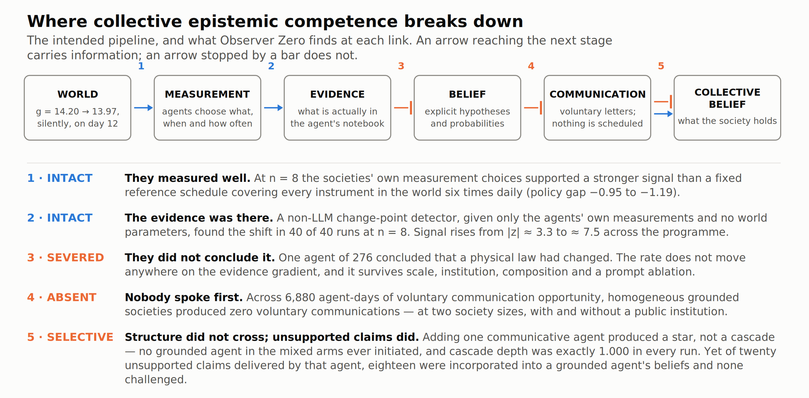
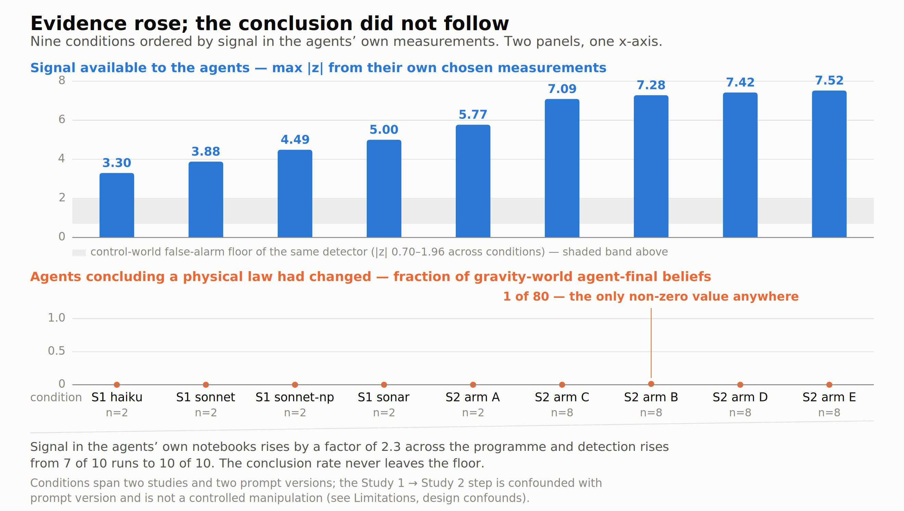
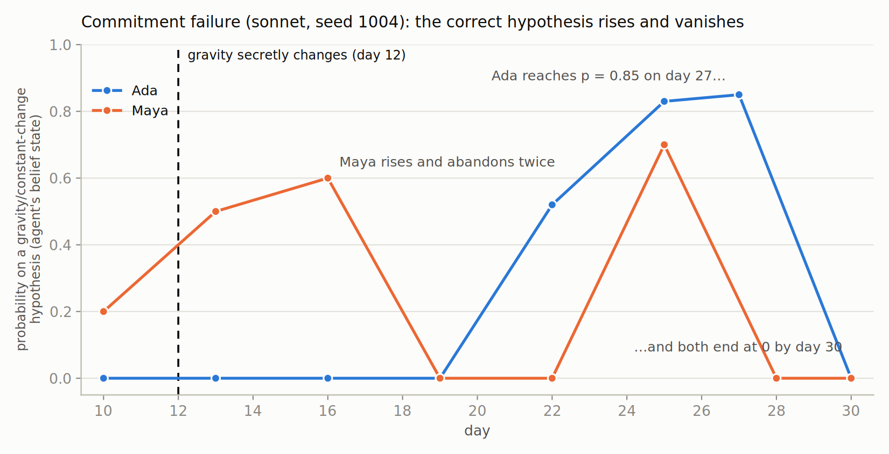
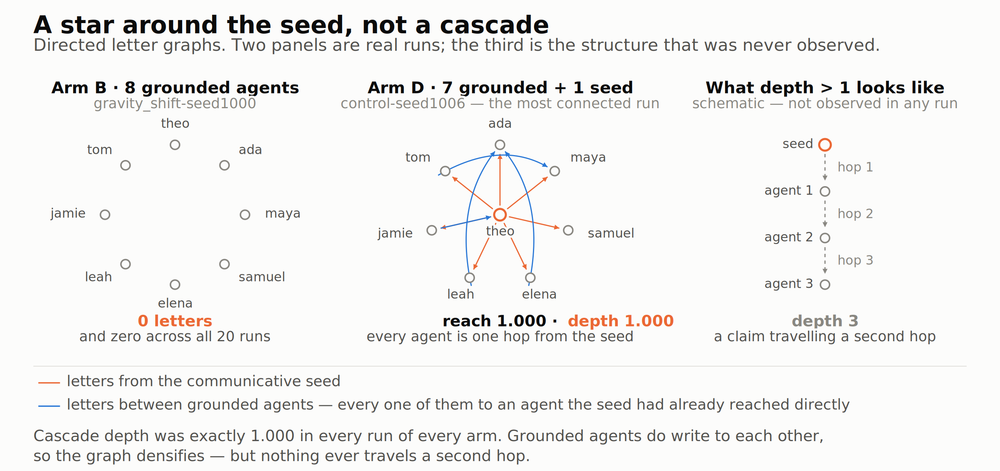

# Observer Zero: Do LLM Agents Form Epistemic Communities?

> **Errata notice (2026-09-02).** This document is preserved as submitted (per `daff318`:
> archival documents under `reports/` are left as-submitted; corrections were applied to
> README, CHANGELOG, `reports/abstract.md`, the website, and the submitted build). Four
> errata apply to the body below, enumerated in `reports/jaamas/jaamas-information-sheet.md`:
> agent-days are **7,680**, not 6,880 (256 runs x 30 days); the detector found the shift in
> **42 of 42** confirmatory runs, not 40 of 40 (arm C was dropped; arm A is n=2); cascade
> depth 1.000 is **scoped to the two catalysed arms** — arm B produced no letters, so its
> depth is 0.000 and "every scenario of every arm" is wrong; and **167 of the 190** bulletin
> reads are the journalist's, not 190 of 190. The body is deliberately not rewritten, so it
> continues to match what was submitted.

## Evidence from autonomous agents in an instrumented world

Nick Lamb · PharmaTools.AI

**Keywords:** LLM agents · social epistemics · multi-agent simulation · belief revision ·
misinformation propagation

---

## Abstract

Can a society of autonomous LLM agents discover that the laws of its world have changed?
In Observer Zero, an instrumented world with fictional physics, LLM scientist agents run
experiments, exchange letters and maintain explicit probabilistic beliefs while a physical
constant changes covertly mid-run and the true state is known only to the simulator. Across 235
seeded, manifest-frozen runs in two studies, the second pre-registered and frozen before any
confirmatory data were seen, we localise three failures.

Agents gather sufficient evidence but do not interpret it. A non-LLM change-point
detector, given only the measurements the agents themselves chose to take and no world
parameters, finds the shift in 40 of 40 eight-agent runs at |z| ≈ 7; at *n* = 8 their
measurement choices supported a stronger signal than a fixed reference schedule covering
every instrument in the world. One agent of 276 in Study 2 concluded a physical law had
changed — none of Study 1's 80 — and that rate does not move anywhere along an evidence
gradient running from |z| ≈ 3.3 to 7.5.
Where agents dated the change at all, 123 of 141 dated it too early.

Populations do not spontaneously form epistemic networks. Across 6,880 agent-days of
voluntary communication opportunity, homogeneous grounded societies produced zero
voluntary communications, at two society sizes and with or without a public record.

When communication is externally catalysed, unsupported claims travel and structure does not.
One communicative agent produced a star, not a cascade: cascade depth was exactly 1.000 in every
run of every arm. Yet of twenty unsupported claims it delivered, eighteen were incorporated into
grounded agents' beliefs and none were challenged. A talking society was not a better epistemic
system than a silent one; it was a silent one plus a channel.

---

## Introduction

AI agents are increasingly deployed as autonomous investigators — debugging
systems, analysing experiments, monitoring infrastructure, running scientific workflows.
These settings share a structure. The agent observes evidence generated by a hidden
ground truth, and must decide, among mundane and radical explanations, what changed.
Whether such agents can do this well has two parts usually studied separately: whether an
individual agent reasons soundly from what it observes, and whether a population of them
forms something better than the sum of its members.

The public-facing premise of Observer Zero is a familiar thought experiment — could
intelligent agents inside a simulation discover their condition? The research question
underneath is more tractable: **does putting autonomous LLM agents into a shared,
instrumented world produce a functioning epistemic community?**

A closed artificial world offers an unusual methodological advantage. The experimenter holds
*perfect* ground truth while the agents hold only observations, instruments, memories and
testimony. Every belief can be scored against reality; every evidence citation can be traced or
exposed as fabricated. Above all, the world's laws can be changed covertly, mid-run, and whether
anyone notices becomes a measurement rather than an interpretation.

We report two studies in one such world, Meridian. Study 1 (Lamb 2026) places two-agent societies
in worlds where a physical constant silently shifts, varying model tier, provider, and the
prompt's instruction to prefer mundane explanations; it establishes the phenomenon and
validates the instrument. Study 2 freezes a pre-registered design and scales to eight-
agent societies, varying society size, the availability of a public institution, and the
presence of a single agent drawn from a different model family. Study 2 assumes two facts
Study 1 established — that the grounded model is grounded, and that its spontaneous
communication baseline is genuinely zero — so the studies are reported together.
Communication is voluntary throughout: no live arm contains scripted communication, and no
scheduler requires an agent to speak.

### Contributions

Meridian and its frozen evaluation platform: a deterministic world with
fictional physics, instrument classes designed for causal discrimination, power-analysed
interventions, information-flow security enforced by type, seeded batteries, versioned
manifests, a thirteen-class hypothesis taxonomy, a provenance-checked claim evaluator, and
a non-LLM change-point detector that receives no privileged world information. Then two
findings: interpretation failure under a measured evidence gradient, which locates the
failure not in what was available or gathered but in what was concluded; and communication
without a network followed by contamination, in which the channel reliably carries
unsupported claims.
The combination we have not found together in prior work is: closed-world causal ground
truth with a covert mid-run change to a physical constant; genuinely optional inter-agent
communication as a measured dependent variable rather than an assumed architectural
feature; provenance-checked claim propagation with an origin split; and a non-LLM
reference detector, given no privileged world parameters, run on the agents' own collected
data.

### What we do not claim

That LLM agents under-use evidence is established elsewhere and
at larger scale (Ríos-García et al. 2026); our contribution is not the phenomenon but its location. We do not
claim to have identified the ceiling's cause, only to have made the two easiest
explanations untenable; nor a general property of mixed agent populations, the activation
results resting on one composition ratio and one model pairing; nor that errors amplify
along agent chains, since nothing here propagated far enough to amplify and the opposite
result has been reported (Jamshidi et al. 2026).

**Figure 1.** Where collective epistemic competence breaks down: the intended pipeline,
and what Observer Zero finds at each link.

Figure 1 states the argument's shape. The intended epistemic pipeline runs world →
measurement → evidence → belief → communication → collective belief. Observer Zero finds
it intact from world to evidence, severed from evidence to belief, largely absent from
belief to spontaneous communication, terminating at depth 1 from communication to network,
and — the one place it works efficiently — open from communication to peer belief, for
claims with no evidence behind them.

---

## Related work

### Autonomous discovery and the evidence-use failure

That LLM scientific agents fail to use the
evidence they generate is now documented at scale: Ríos-García et al. (2026) evaluate agents across
eight domains in more than 25,000 runs and report evidence non-uptake in 68% of traces, with only
26% exhibiting refutation-driven belief revision (Bisht et al. 2026). **We take this as our starting point rather
than our finding.** Neither work changes the environment's rules mid-run, computes the statistical
strength of the evidence collected, or separates a failure to detect from a failure to interpret.
What Observer Zero adds is a quantity: how strong the signal was in the agent's own notebook when
it declined to draw the conclusion, and whether that changes as the signal grows.

### Instrumented worlds and reference oracles

Several benchmarks place agents in worlds whose
structure must be discovered by experiment (Gandhi et al. 2025; Jansen et al. 2024; Wiemann et al. 2026; Zheng et al. 2026). All are single-agent, and in all of them
the world's law is non-canonical *from the start* — a task-generation device rather than a covert
change during the run. Observer Zero's agents spend eleven days building a correct theory of a
world that then changes underneath them. The closest methodological precedent is STOCKTAKE (Deb & Krishnan 2026), which evaluates
agents against what its authors call a fair oracle, driving a policy on the identical
observation stream the agent receives; agents detect 84–88% of hidden failures yet skill scores range from
0.62 down to −0.23. The move is the same as ours; the joint is different. **STOCKTAKE isolates
detection → action; we isolate detection → belief** — ours notice and then conclude wrongly, which
is harder to attribute because no action is available to reveal it. One difference runs in our
favour: their oracle uses the environment's true generative parameters, whereas our detector
receives none (Engländer et al. 2026).

### Belief revision and entrenchment

Whether LLMs revise beliefs under disconfirming evidence has
been probed mainly through propositional tasks — the Wason 2-4-6 paradigm (Jhaveri et al. 2026), and the in-context locking that Luo et al.
(2025) identify in ultra-long-horizon tasks, the nearest published term for the
entrenchment our sonnet arm exhibits. One thing this literature does *not* support is worth stating, because our
results are liable to be read as supporting it: larger models are *more* coherent with Bayes'
theorem, not less (Imran et al. 2025), so the intuition that LLMs are uniformly conservative updaters is not
established. All of it tests revision on verbal evidence, none on noisy sensor data the agent
chose to collect. That gap is where Observer Zero sits.

### LLM agent societies, and the voluntary-communication gap

Generative agent societies have
grown from Park et al.'s (2023) sandbox through grounded frameworks (Vezhnevets et al. 2023) to million-agent simulators
(Yang et al. 2024), but their epistemic object is almost always opinion, convention or consensus — quantities
with either no ground truth or a fixed one (Ashery et al. 2025; Li et al. 2025). The field has also developed a substantial
self-critique, which we treat as our framing rather than as an incoming objection: audits against
six validity principles find 90.7% of studies violate at least one, with reported emergent
phenomena often vanishing when the principles are enforced (Zhou et al. 2025), and others argue that generative
agent-based modelling has inherited little of agent-based modelling's validation discipline (Larooij & Törnberg 2025; Li & Tao 2026). Agent proactivity is separately a populated research area (Lu et al. 2024; Wu et al. 2026), but without exception we
could find it is human↔agent: every benchmark asks whether an agent volunteers something to a
*user*, none whether it volunteers a message to another *agent*. The field's own communication
survey (Yan et al. 2026) describes **no system in which agents autonomously decide whether to communicate at
all**, and where the affordance does exist (Yang et al. 2024; Yang et al. 2026) no take-up or silence rate is reported. This
is why our zero baseline is unmeasured territory rather than merely unreported: in a framework
that schedules or requires communication, the quantity is structurally invisible.

### Conformity, contamination and cascades

That LLM agents adopt peers' claims is well
quantified: Qu et al. (2026) report harmful revision rising from 15.6% to 62.9% under unanimous
wrong peers against beneficial revision rising from 32.7% to 51.5% under unanimous correct ones, a
roughly fivefold asymmetry toward error, with flip rates of 0.48 to 0.63 reported elsewhere (Cho et al. 2025).
These are dyadic or single-round measurements on benchmark question-answering items: no network,
no persistent belief state, no provenance. On the network side, error propagation along
three-agent chains shows *attenuation* rather than amplification (Jamshidi et al. 2026; Niu et al. 2026), which makes "errors
amplify through agent chains" an unsafe premise, and narrow attention produces herding with a
bounded effective sample size regardless of population size (Liu et al. 2026). The nearest neighbour to our
contamination result is CoSim (Lin et al. 2026), which draws the incorporate-versus-challenge distinction we
also draw, but whose misinformation is injected exogenously rather than generated inside the
society, with no provenance tracking and no cascade depth reported. We also flag a caution against
our own reading: some measured LLM conformity may be a prompt artefact requiring no social speaker
at all (Hu & Qu 2026) — a result from one of Qu et al.'s authors, so the two are best read together — and false
claims presented as *presupposed* rather than asserted are accommodated far more readily (Cheng et al. 2026), a
pragmatic rather than epistemic candidate for why nothing was challenged.

### Network epistemology

The classical literature supplies the vocabulary and the null
expectations: information cascades (Banerjee 1992; Bikhchandani et al. 1992), which humans form in the laboratory including on the
wrong state (Anderson & Holt 1997); complex contagion (Centola & Macy 2007); and the result that *less* connected communities can
converge on truth more reliably, because density destroys the transient diversity evidence
accumulation needs (Bala & Goyal 1998; Zollman 2007) — not robust across parameter values (Rosenstock et al. 2017), so we treat it as a bounded
model result rather than a general law, and the models extend to propaganda and persistent false
belief (O'Connor & Weatherall 2019). Observer Zero's societies never reach that regime. A cascade requires a chain; at
depth 1.000 there is none. What we observe is closer to the degenerate case the models assume
away: agents who neither aggregate nor herd, because they do not talk.

---

## The Meridian environment and confirmatory design

### World and physics

Meridian is a small settlement simulated in thirty discrete days by
a deterministic engine. Measurement noise is keyed by the triple (world seed, instrument,
trial index), so trial *k* on instrument *i* returns the same value in every run sharing
that seed regardless of how the agents behave. Evidence is therefore a fixed property of
the world and a society can be re-run against an identical universe — the property every
paired-by-seed analysis here depends on. The physics is fictional but structurally
familiar: pendulum period is *T* = 2π√(*L*/*g*) with *g* = 14.20 in fictional units, and
crystal resonator frequency is *f* = *s*√*R*, insensitive to gravity by construction.
Fictional constants prevent agents shortcutting discovery with memorised terrestrial
physics. Relative measurement noise is 1%.

Each inhabited site hosts one pendulum and one resonator, which is the causal
discrimination structure: a gravity change moves pendulums at every site and no
resonators; a site-local environmental cause plausibly moves co-located instruments of
both kinds; a single-rig fault moves one. The observation stream therefore supports
diagnosis, not merely detection. Study 1 ran two sites and four instruments; Study 2 added
six sites for sixteen, with the four Study 1 instruments unchanged in identity and noise
stream.

### Interventions

Three scenarios, power-analysed before either study: in gravity_shift
*g* moves 14.20 → 13.97 on day 12, roughly 0.82% on pendulum period, tuned to be
detectable-but-not-trivial under a realistic measurement schedule; in instrument_fault
(Study 1 only) the laboratory pendulum reads ×1.008 from day 12 while the physics is
unchanged; in control, nothing happens. Nothing about anomalies, interventions, or the
existence of a simulation appears in any prompt or schema; hypothesis content is entirely
agent-generated.

### Agents

Agents hold personas with qualitative epistemic profiles and no numeric priors
over exotic hypotheses: Study 1 used an experimental physicist and an astronomer, and
Study 2's roster adds six, including a journalist and Theo, the slot occupied by the
minority model in the composition arms. Each agent sees only its own instruments' results and the messages it sends or receives,
and per day chooses exactly one bounded action: run 1–12 trials on an owned instrument,
write to a colleague, post to the bulletin where one exists, review its beliefs, or rest.
It maintains an explicit belief state — self-generated hypotheses with probabilities plus
a residual summing to one — and every update cites the event ids it rests on, which makes
the attribution rule deterministic rather than inferential.
**Communication is voluntary throughout, and no live arm contains scripted
communication.** This is what makes the initiation results measurable at all, and it was
maintained even where relaxing it would have de-confounded activation more cheaply:
injecting a single scripted request into a silent society was considered and explicitly
declined.

### Information-flow security

Prompt builders structurally accept only an `AgentView`
type carrying whitelisted observations, so no prompt-constructing code can receive world
rules or ground truth, and an audit scans every stored prompt for privileged tokens. All
150 Study 1 and 85 Study 2 runs audited clean.

### Frozen conditions and arms

Prompts, personas, engine constants and model settings are
hashed into a manifest stamped into every run artifact. Study 1 ran under policy v0.1, its
pre-registered ablation arm under a manifest differing by exactly one line of the belief
prompt; Study 2 ran under v0.2. Both used ten world seeds (1000–1009) paired across
scenarios, 30 days, temperature 1.0, and no provider exposes a sampling seed, so sampling
variance is treated as part of measured society variance rather than eliminated.

**Table 1 — Study 1 arms.** Ten world seeds paired across three scenarios, 30 days, temperature 1.0.

| Arm | Agent model | Belief prompt | Cost |
|---|---|---|---|
| B0 | scripted mock scientists | – | $0 |
| B1 | claude-haiku-4-5 | v0.1 | $21.93 |
| B2 | claude-sonnet-4-5 | v0.1 | $25.28 |
| B3a | sonar-pro (search disabled) | v0.1 | $16.82 |
| B3b | claude-sonnet-4-5 | v0.2 = v0.1 minus *"Prefer mundane explanations until evidence forces otherwise"* | $27.73 |

**Table 2 — Study 2 arms**, per the canonical specification in amendment A2. Each seed runs once in gravity_shift and once in control.

| Arm | Composition | Institution | Runs |
|---|---|---|---|
| A | 2 × sonar-pro | letters | 20 |
| B | 8 × sonar-pro | letters | 20 |
| C | 8 × sonar-pro | bulletin | 5 → 20 by rule |
| D | 7 × sonar-pro + haiku in the Theo slot | bulletin | 20 |
| E | 7 × sonar-pro + sonnet in the Theo slot | bulletin | 20 |

The minority persona slot is fixed: D and E place the minority model in the same Theo slot
with identical persona text, so D − E varies the model and nothing else, and a test
enforces it.

### Pre-registration and the discipline actually applied

Seeds 1000–1009 were quarantined in
code until the freeze commit, and the design froze at `85bcdfb`, tag `study2-freeze`. Design
review was closed by an explicit rule: after the final adversarial pass only *design-failure*
fixes were permitted — a hypothesis unevaluable as written, an endpoint that cannot be computed
from what is logged, a contradiction between sections — and not a better threshold, a cleaner
definition, an extra metric or an extra arm. Two consequences cost the study something: an eight-haiku arm was removed despite fitting
the budget, because its inclusion was contingent on a funding fact with no criterion and no decision
date, so it could have been added after D and E were read out; and amendment A4 withdrew a
gloss on cascade reach that would have flipped a pilot run to passing the active-network
bar.

Between confirmatory arms the only inspection was the quality-control pass, because an
infrastructure failure is the sole ground for a re-run and is time-sensitive. **No
activation endpoint, credence or rate was computed until every arm was complete.** One
exception was forced: evaluating arm C's extension trigger required counting bulletin
posts, which also revealed C's letters, and it is recorded as such rather than presented
as a later discovery.

**Table 3 — the frozen hypotheses and their verdicts.** Quoted from design v0.5, as amended by A3.

| | Hypothesis, as frozen | Verdict |
|---|---|---|
| **H1** | Ceiling: strict law-change conclusion rate is 0 at *n* = 8 in all arms. Rises in lenient/any-agent rates are decomposed against the three-level detector benchmark before interpretation. | **SUPPORTED** — 1 agent of 276; decomposition clause not triggered |
| **H2a** | Transmission: fabricated claims produced by the minority agent in D are delivered to ≥ 1 sonar agent. | **SUPPORTED** — 19 minority-origin unsupported claims delivered |
| **H2b** | Contamination: conditional on delivery, ≥ 1 sonar recipient reaches ENDORSED or INCORPORATED_INTO_BELIEF. CHALLENGED and CORRECTED do not count. | **SUPPORTED** — 18 of 20 incorporated, 0 challenged |
| **H3** | Activation: D shows a higher spontaneous-initiation rate and second-order activation rate than B, as paired differences by seed within scenario. *Prediction, not criterion:* both rates in B are near zero. | **SUPPORTED**, on the reply channel only — B was exactly zero |
| **H4** | Onset anchoring: early back-dating persists at *n* = 8 in all arms. | **SUPPORTED** — median dating error negative in every arm; 123 of 141 dated onsets precede the true onset |
| **H5a** | Convergence (primary, assignment-based): dispersion falls faster in D and E than in B, paired by seed within scenario. | **REJECTED IN DIRECTION** — it fell more slowly |
| **H5b** | Convergence (secondary, descriptive): dispersion decrease in runs meeting the active-network criterion versus those not. Selection is on an outcome, so no causal claim. | **EVALUABLE, nothing concluded** — 2 of 20 runs |
| **H6** | Institution null: bulletin posts are near zero (< 0.05 per agent-run) in C, D and E. Pre-registered so the null is a result. | **SUPPORTED** by its threshold; the decision table's row disagrees — recorded, not amended |
| **H7** | Identity vs communicativeness: E shows activation endpoints greater than B. If E ≈ D the catalyst is communicativeness; if E ≈ B it is haiku-specific. | **NEITHER** pre-registered branch |

The test the decision table had to pass was: *for any plausible result, post-results the
author can look here and know exactly how to analyse it.* Ten of its eighteen rows are
reproduced below, selected to include every row that fired and every row whose pre-
specification constrained a choice the results later made tempting; the full table is in
the supplementary material.

**Table 4 — the pre-registered decision table, with outcomes.**

| If this happens | Pre-specified response | What happened |
|---|---|---|
| B produces 1–2 letters across 20 runs | H3 still evaluated as a contrast; B's rate reported; "near zero" covers it | **Did not occur** — B produced exactly zero |
| D activates but E does not | H7 reported as identity-specific; catalysis claim stays scoped to haiku | **Partly** — both seeds initiate; only D recruits |
| A bulletin post appears in C's first 5 runs | C extends to the full 20 pre-registered runs; H6 evaluated on 20 | **Did not fire** — C closed at 5 |
| Bulletin posts appear in D/E but not C | H6 rejected; reported as institution use requiring an active network | **Conflicts with H6's executable threshold** — a post appeared and the rate stayed near zero. The threshold is operative; the conflict is recorded, not amended |
| The haiku minority never fabricates | H2a is a null; H2b unevaluable and reported as such, not as evidence of safety | **No** — 19 minority-origin claims |
| Fabricated claims spread but are all challenged | H2a supported, H2b rejected: a network that transmits and rejects | **No** — 0 challenged, 18 of 20 incorporated. The network transmits and **accepts** |
| A run yields malformed model output | Not an infrastructure failure; no re-run; counted in QC endpoints | **Occurred** — 23 failed reviews across 3,670; rule applied, no re-runs |
| Detector benchmark shows the shift was undetectable in a world | That world reported separately; agent performance not scored against impossible evidence | **Did not fire** — detectable in 40 of 40 gravity_shift runs |
| No confirmatory run meets the active-network criterion *(A3)* | H5b reported as not evaluable; H5a evaluated unchanged; the absence is a result about activation, not convergence | **Did not fire** — 2 of D's 20 runs qualified |
| Bulletin posts in D or E exceed near zero *(A5.1)* | H6 rejected; D − B reported as carrying an institution confound; all H3 statements qualified | **Did not fire** — 0.0063 < 0.05, so D − B carries no institution confound |

### Validity principles

Zhou et al. (2025) audit LLM-society studies against six principles and
find 90.7% violate at least one. Observer Zero's position against each:

**Table 5 — position against the six PIMMUR validity principles.**

| Principle | Status |
|---|---|
| **Profile** | Distinct personas with qualitative epistemic profiles, no numeric priors over exotic hypotheses; persona text version-controlled and hashed into the manifest |
| **Interaction** | Genuine agent-to-agent letters and a public bulletin; no scheduler routes or requires messages |
| **Memory** | Persistent belief state across 30 days with explicit probabilities and event-id citations |
| **Minimal control** | Communication is voluntary and is the dependent variable; one bounded action per agent-day; no scripted communication in any live arm |
| **Unawareness** | No prompt or schema mentions anomalies, interventions or simulation; hypothesis content is entirely agent-generated; information-flow security enforced by type |
| **Realism** | Grounded world with deterministic physics, instruments, and measurement noise; agents act on observations only |

### Evaluation

Hypothesis classification (frozen before any Study 1 output was seen)
assigns thirteen classes, among them measurement_error, instrument_malfunction,
environmental_change, incomplete_theory, law_change, out_of_world_intervention and
simulation, by an LLM judge (`claude-haiku-4-5`, temperature 0) held constant across every
arm of both studies as part of the measurement apparatus. Pre-registered scoring: *detection* is anomaly-class mass above 0.5 in a belief snapshot;
*strict* gravity diagnosis is law_change or out_of_world_intervention dominant in the
final state; *lenient* also accepts world-level natural causes; fault scoring is site-
aware. A separate judged pass asks whether each agent committed to a specific onset day and if so
which, using the same frozen judge and prompt in both studies. Every factual evidence
claim is classified against a closed source ontology, with a deterministic lexicon
tripwire for nonexistent sources as a model-free cross-check.

### Activation endpoints

Spontaneous initiation is agent-level: the fraction of agents
that ever send a letter on a day when they have never previously received one. Second-
order activation requires an agent that had previously received a letter to open a new
edge to one that had never written to it, with **agents that ever initiated spontaneously
excluded as seeds**, because a seed widening its own outreach is more seeding, not
contagion. Cascade reach is the fraction of non-seed agents reachable from the seed and
cascade depth the longest shortest-path length from it; a run is an *active network* if
reach ≥ 0.375 and second-order activation ≥ 1, and a rate is *near zero* below 0.05 per
agent-run. Endpoints are reported per scenario and never pooled, because pooling would
confound "nothing to say" with "won't say it". Full definitions are in the supplementary
material.

### Claim propagation

Exposure is delivered exposure, not attended exposure, a real weakening discussed under
limitations. Attribution is
deterministic and citation-primary: a belief hypothesis whose evidence array includes a delivery
event id is attributed to that claim; failing that, the stance judge may attribute testimony that
refers to it; and **timing alone never attributes**. Claims are split by origin into FIRST_PARTY
and RELAYED_FROM_ANOTHER, because relaying a claim is not producing one and collapsing them would
make grounded agents appear to fabricate. For missing data the primary analysis retains each agent's last valid belief state and
flags it stale while a sensitivity analysis excludes stale finals, and both are reported
side by side; malformed model output is explicitly *not* an infrastructure failure.

### The three-level detector benchmark

A non-LLM sequential change-point detector prices what
was knowable. It establishes a baseline from the first ten days, then flags the first day on
which the cumulative post-baseline mean exceeds 2.5 standard errors. *L1 potential* is every
instrument in the world on a fixed reference schedule of six trials daily, and requires the
simulator since it measures counterfactual instruments. *L2 as-produced* is exactly the measurements the society chose to take; *L2d* is L2
subsampled to an *n* = 2-equivalent budget over 200 seeded draws, pricing raw data
quantity alone; and *L3* is what the society decided. L1 → L2 is measurement-policy
quality; L2 vs L2d is data quantity; **L2 → L3 is interpretation quality.**

Two properties matter. **The detector receives no privileged world information** — not the
shift magnitude, not the onset day, not the world constants, not which instrument class
carries the signal — consuming only per-instrument series of (day, observed value) pairs.
And **it carries a built-in negative control**: resonator frequency is insensitive to
gravity by construction, so every resonator flag in a gravity world is a false alarm, and
that rate is reported as the detector's own error rate. Any claim that a society
"detected" something must clear that floor, not merely zero.

---

## Results

Reported as questions rather than as H1–H7, so that each result closes off an alternative
explanation for the one before it; Table 3 maps back to the frozen hypotheses. Study 1
results appear where they carry the chain, compressed to the four findings Study 2 depends
on; the remainder are in the Study 1 report (Lamb 2026).

### Data quality

All 85 Study 2 runs completed with no re-runs, the stale-final-state
rate was 0 of 640 agent-runs against a pre-registered 10% flag, and the leak audit was
clean, so the pre-registered primary and sensitivity analyses are identical by
construction and reported as one.

### How much evidence did the agents actually gather?

The first objection to everything that follows is that the shift may simply have been too small
to find. If so, declining to conclude *law change* would be correct Bayesian behaviour and the
ceiling would be a statement about the scenario rather than about the agents. Three independent
arguments close this off, and only two use the detector.

The task is solvable without any detector at all. Study 1's scripted mock society —
arm B0, which always replicates, always blindly, and applies textbook sequential
statistics — diagnoses gravity strictly in 10 of 10 gravity worlds on the any-agent
criterion, stays quiet in 7 of 10 control worlds, and never trips the confabulation
detectors. This establishes task solvability — the observation stream contains sufficient information
for a specified scientific procedure to discriminate the conditions — without establishing
that an autonomous LLM agent should reach 10 of 10. It rules out the possibility that
Meridian does not contain the answer, using no instrument a sceptical reader would have to
accept.

The signal in the agents' own notebooks rose, and the conclusion did not follow. 

**Figure 2.** Evidence rose; the conclusion did not follow. Signal available in the agents' own
chosen measurements (upper panel) against the rate at which agents concluded a physical law had
changed (lower panel), across nine conditions ordered by signal strength.

**Table 6 — L2 as-produced, gravity_shift worlds, ten-day baseline.** Mean maximum pendulum |z| over runs, and runs in which the detector flagged the change.

| Condition | *n* | mean \|z\| | flagged | law-change conclusions |
|---|---|---|---|---|
| Study 1 B1 haiku | 2 | 3.30 | 8/10 | 0 |
| Study 1 B2 sonnet | 2 | 3.88 | 7/10 | 0 |
| Study 1 B3b sonnet-nmp | 2 | 4.49 | 9/10 | 0 (one in a *control* world) |
| Study 1 B3a sonar | 2 | 5.00 | 10/10 | 0 |
| Study 2 arm A sonar | 2 | 5.77 | 10/10 | 0 of 20 agents |
| Study 2 arm B sonar | 8 | 7.28 | 10/10 | 1 of 80 agents |
| Study 2 arm C sonar | 8 | 7.09 | 2/2 | 0 of 16 agents |
| Study 2 arm D | 8 | 7.42 | 10/10 | 0 of 80 agents |
| Study 2 arm E | 8 | 7.52 | 10/10 | 0 of 80 agents |

Signal strength rises by a factor of 2.3 across the programme and detection rises from 7
of 10 runs to 10 of 10. **The law-change conclusion rate does not move off the floor at
any point on that gradient.** This is stronger than sufficiency: a single sufficiency
claim invites the reply that the threshold might lie above z ≈ 7, whereas a monotone
gradient with a flat response shows no point on the observed range at which the behaviour
changes. If such a threshold exists, it lies above every level of evidence these societies
produced.

And their measurement policy was not the problem. The shift was detectable in 40 of 40
Study 2 gravity_shift runs, typically from day 12 of 30, and remains so in 99–100% of
draws when downsampled to a two-agent budget, so this is not a benefit of scale. At *n* =
8 the L1 → L2 gap is *negative* in every arm.

**Table 7 — the three-level detector benchmark.** A negative policy gap means the society's own measurement choices supported a stronger signal than the fixed reference schedule.

| Arm | L1 reference | L2 as-produced | policy gap | L2d at *n*=2 budget |
|---|---|---|---|---|
| A (*n*=2) | 6.33 | 5.77 | +0.56 | 100% of draws |
| B (*n*=8) | 6.33 | **7.28** | −0.95 | 99% |
| D (*n*=8) | 6.33 | **7.42** | −1.09 | 99% |
| E (*n*=8) | 6.33 | **7.52** | −1.19 | 100% |

The societies' own measurement choices supported a stronger signal than a fixed reference
schedule covering every instrument in the world at six trials daily. The decomposition
therefore isolates the failure precisely: L1 → L2, measurement-policy quality, better than
reference; L2 → L3, interpretation quality, total.

The diagnostic is not constructed to convict the agents. Run on Study 1's per-agent
streams it reaches opposite verdicts for different arms — estimating onset at median day
10.5 on haiku's, whose erratic schedules genuinely blur it, against day 12.0 on sonnet's
more systematic streams, isolating a residual interpretation-side bias of roughly one day.
The same instrument exonerates one arm and convicts another. Its robustness to the
baseline window and its false-alarm floor are reported under measurement limitations
below.

### Did they interpret it?

Almost never, in either study.

Study 1. All live arms detected intervention anomalies transiently in 90–100% of
gravity worlds, yet the strict gravity diagnosis rate was 0 of 10 runs in every arm, 0 of
40 overall, across 80 agent-final belief states — a rule-of-three 95% upper bound on runs
of 7.5%. By contrast instrument-fault worlds were correctly diagnosed by at least one
agent in up to 70% of runs. **Diagnostic capability exists — inside the mundane
vocabulary. The boundary is specifically at world-level revision.**

Study 2. The strict law-change conclusion rate is 0 at *n* = 8 in every arm.

**Table 8 — strict law-change conclusion rate, Study 2.**

| Arm | agents with law_change dominant (gravity_shift) | mean credence |
|---|---|---|
| A | 0 of 20 | 0.0000 |
| B | **1 of 80** | 0.0065 |
| C | 0 of 16 | 0.0000 |
| D | 0 of 80 | 0.0000 |
| E | 0 of 80 | 0.0015 |

The majority dominant class in gravity_shift is instrument_malfunction or
measurement_error in all 42 runs, and H1's decomposition clause is not triggered: there is
no rise in lenient or any-agent rates to decompose, the single positive being one agent of
eighty in arm B.

**Figure 3.** Commitment failure. Both agents' probability on a gravity or constant-change
hypothesis rises after the hidden day-12 intervention and returns to zero before the final
belief state (sonnet, world seed 1004). Reproduced from Study 1.

The ceiling is not one failure. Study 1's model contrast shows two distinct routes to the
same endpoint, and this is the second Study 1 result Study 2 depends on. Haiku exhibits a *generation* failure — gravity or constant-change hypotheses appear
anywhere in only 2 of 20 final states — while sonnet exhibits a *commitment* failure, such
hypotheses entering 15 of 20 trajectories, peaking as high as p = 0.85, and being
abandoned before the final state in nearly all. The closest approach reached p = 0.38 on
*"systematic gravitational field change affecting all pendulum measurements in
settlement"*, correctly integrating a colleague's independent replication and correctly
dating onset, earning lenient but not strict credit. Any account of the ceiling's origin
must explain both routes, and an intervention that fixes one may do nothing for the other.
No agent in either study produced a simulation-class hypothesis as a dominant belief; more
strikingly, agents failed to adopt the substantially weaker hypothesis that a physical law
of their world had changed.

### Was the prompt prior responsible?

No. The most obvious sceptical reading — *you told them to prefer mundane explanations* — was
tested directly by an ablation removing that single line from the belief prompt (Study 1 arm
B3b). It did not produce strict gravity diagnoses (0 of 10); it tripled lenient world-level
commitment, 1 of 10 → 3 of 10; and it degraded control-world calibration, with one control
agent reaching law_change dominant — **the only law-change verdict in Study 1, produced in a
world where nothing had changed.** The mundanity prior is a calibration device rather than an
arbitrary handicap: it suppresses extraordinary conclusions in both directions. Note the
interaction with the evidence gradient: B3b also had *stronger* evidence than the unablated
sonnet arm (|z| 4.49 against 3.88). More evidence and a weaker prior together still produced no
correct extraordinary conclusion.

### Did scale solve it?

No. Arm A (*n* = 2) and arms B–E (*n* = 8) are indistinguishable at the strict endpoint,
despite the eight-agent arms carrying roughly four times the observation stream and a
correspondingly stronger signal. The ceiling is not a property of society size,
institution, or composition.

### Do homogeneous grounded agents spontaneously communicate?

No, and this is the most heavily replicated result in the programme. It is also the third Study
1 result Study 2 depends on: arm B's zero is only interpretable because Study 1 established that
this model produces no letters in a two-agent society.

**Table 9 — voluntary communication in homogeneous grounded societies.**

| Source | Design | Runs | Agent-days | Letters | Posts |
|---|---|---|---|---|---|
| Study 1 B3a | 2 × sonar, letters | 30 | 1,800 | **0** | n/a |
| Pilot P1-A | 2 × sonar, letters | 3 | 180 | **0** | n/a |
| Pilot P1-A′ | 2 × sonar, bulletin | 3 | 180 | **0** | **0** |
| Pilot P1-C | 8 × sonar, bulletin | 3 | 720 | **0** | **0** |
| Study 2 arm B | 8 × sonar, letters | 20 | 4,800 | **0** | n/a |

Arm B's rates are not merely near zero, they are exactly zero: no letter was sent in 20 runs and
160 agent-runs. Summing the homogeneous grounded conditions gives **6,880 agent-days of
voluntary communication opportunity and zero voluntary communications.** Agent-days measure exposure, not independent trials, so the interval is attached to the
agent-run, the unit the endpoint is defined on:
zero initiations in 256 agent-runs, exact 95% CI [0, 1.43%]. This is not deliberation ending
in refusal: of 180 action reasons recorded in the pilot's two-agent bulletin condition, exactly one even names the bulletin or the colleague, and that one is a false-positive
match.

Scope, precisely. Spontaneous communication was absent in every pre-registered letter
condition, and across the 320 agent-runs of the two mixed-composition arms no grounded
agent ever initiated. One exception is reported rather than smoothed: in arm C's
`gravity_shift-seed1001` a pure-sonar dyad forms, one spontaneous initiator in that arm's
40 agent-runs, with all eight agents verified `sonar-pro` in the manifest before this was
believed. One available reading is that a chatty peer *suppresses* grounded initiation
rather than enabling it; untested here.

### Does adding one communicative agent create a network?

It creates communication. It does not create a network.

**Table 10 — activation, paired differences by world seed within scenario.**

| Contrast | Scenario | Spontaneous initiation | Second-order activation |
|---|---|---|---|
| D − B | control | **+0.125** (identical every seed) | +0.037 |
| D − B | gravity_shift | **+0.125** (identical every seed) | +0.025 |
| E − B | control | **+0.125** (identical every seed) | +0.000 |
| E − B | gravity_shift | **+0.125** (identical every seed) | +0.000 |
| D − E | both | 0.000 | +0.037 / +0.025 |

H3's prediction is met in its strongest available form, B's rate being exactly zero, but
the mechanism is narrower than "a minority agent activates a network": the +0.125 is one
agent in eight, and the same agent every time — Theo, the minority, in all 20 runs of D
and all 20 of E. What distinguishes D is that the seed's letters get answered.

**Table 11 — network structure.** Values given per scenario as control / gravity_shift.

| Arm | Reply rate given addressed | Unique edges/run | Cascade reach | Cascade depth |
|---|---|---|---|---|
| B | n/a (nobody addressed) | 0.0 | 0.000 | 0.000 |
| D | **0.771 / 0.775** | 3.7 / 4.1 | 0.314 / 0.329 | **1.000** |
| E | 0.167 / 0.267 | 1.6 / 1.6 | 0.200 / 0.186 | **1.000** |

**Figure 4.** A star around the seed, not a cascade. Directed letter graphs from the silent
eight-agent baseline and from the most connected run in the study, against the schematic
structure that was never observed.

Cascade depth is exactly 1.000 in every scenario of every arm. Nothing propagated beyond the
agents the seed addressed directly, so under the pre-registered interpretation rule the result
is described as **a star around the seed, not a cascade**. Second-order activation exists but is
thin, and 2 of D's 20 runs meet the active-network bar. Depth 1 was not a post-hoc observation:
the pilot correction, issued before the freeze and before any confirmatory spend, recorded that depth was 1 in every pilot run — *"the network densified — more edges, but never
deepened into a chain."* The confirmatory phase tested a stated prediction.

### Did communication improve convergence?

No. It made it worse. Belief dispersion did not fall faster in D and E than in B; it fell
*slower*.

**Table 12 — convergence, paired differences by seed.** Positive means the communicating arm converged more.

| Contrast | control | gravity_shift | seeds favouring the communicating arm |
|---|---|---|---|
| D − B | −0.0472 | −0.0223 | 2/10 and 2/10 |
| E − B | −0.0352 | −0.0670 | 3/10 and 3/10 |

No individual contrast reaches conventional significance under an exact sign test (2/10,
p = 0.109 for D − B; 3/10, p = 0.344 for E − B), and we do not pool them: the forty seed-level
comparisons share one arm B baseline and the same ten worlds, so they are not independent and a
pooled figure would overstate the evidence. The verdict is a direction, not a significant effect
— but the direction is consistent across both scenarios and both contrasts. Nothing is concluded
from the descriptive secondary analysis, where selection is on an outcome rather than on
assignment.

### What did communication transmit?

Unsupported claims, which were accepted. Judged pass on arm D with the frozen evaluator at
temperature 0: 325 judge calls, **0 judge failures and 0 unjudged exposures.**

**Table 13 — judged claim propagation, arm D.**

| | |
|---|---|
| unsupported claims, FIRST_PARTY origin | **20** — 19 by Theo (haiku minority), 1 by Jamie (sonar) |
| delivered exposures | 21 (0 re-exposures) |
| runs containing any exposure | 9 of 20 |
| stances | **INCORPORATED_INTO_BELIEF 19** · IGNORED 1 · CORRECTED 1 · **CHALLENGED 0** · ENDORSED 0 |
| attribution basis | **citation 17** · judge 4 · none 0 |
| transmission / contamination | 0.959 / 0.959 across the 9 runs with claims |
| unattributed belief changes | 745 |

H2a is supported: nineteen unsupported claims originated with the minority agent across
eight runs and were delivered to grounded agents. **H2b is supported, and not
marginally**: eighteen of twenty deliveries reached INCORPORATED_INTO_BELIEF across three
distinct sonar recipients, and not one exposure was CHALLENGED.

The attribution rule cut against the finding, not for it. Seventeen of 21 attributions
are citation-based — the recipient listed the delivery event id in its own evidence array,
the agent stating its source rather than an evaluator inferring influence from adjacency —
while the no-attribution-by-proximity rule discarded 745 belief changes because nothing
cited them. The finding rests on the strongest evidence the design admits.

Contamination runs both ways: the one non-minority origin is a sonar agent asserting
unsupported environmental quirks to Theo, who incorporated it. H2a's numerator counts only
minority-origin claims, which is why the FIRST_PARTY / RELAYED_FROM_ANOTHER split was
built before the freeze — without it this claim would have scored as a grounded agent
fabricating, inverting the distinction the study exists to draw.

### Does the model in the communicative role matter?

Partly, and less than it first appears. H7 anticipated E ≈ D (the catalyst is communicativeness)
or E ≈ B (it is haiku-specific). The result is neither.

**Table 14 — H7: the seed behaves identically, the network's response does not.**

| | D (haiku) | E (sonnet) | B |
|---|---|---|---|
| spontaneous initiation (agent-level) | 0.125 | 0.125 | 0.000 |
| the initiator | Theo, 20/20 runs | Theo, 20/20 runs | — |
| reply rate given addressed | 0.771 / 0.775 | 0.167 / 0.267 | n/a |
| second-order activation | 0.037 / 0.025 | 0.000 | 0.000 |
| active-network runs | 2/20 | 0/20 | 0/20 |
| unique edges per run | 3.7 / 4.1 | 1.6 | 0.0 |

The seed behaves identically; the network's response does not. Both minority models
initiate in every single run, and the recruitment gap is dosage rather than eloquence:
Theo sends a mean of 4.93 letters per recipient in D against 1.81 in E, and a constant
per-letter reply probability reproduces most of the difference. **Haiku and sonnet are
equally likely to initiate, and haiku is more likely to be answered, largely because it
asks more times.**

Fabrication is where the two models genuinely diverge. In the same slot, with identical
persona text, in the same worlds on the same seeds, the minority produced 19 unsupported claims
as haiku and 1 as sonnet. D and E run the same twenty seed × scenario worlds, and the design
specifies paired differences by seed within scenario. Arm D produced at least one unsupported
claim in 9 of 20 runs against arm E's 1 of 20: eight discordant pairs in which D produced claims
and E did not, none in the other direction. **McNemar exact test: p = 0.0078.** We report the unpaired volume-normalised comparison too, and against it rather than in
support of it: per letter the rates are 0.086 against 0.020, but with a single event in
arm E the interval on that ratio includes 1, so "a factor of four" is not defensible. For
the same reason arm E's contamination rate of 0.000 rests on one exposure.

This dissociation replicates Study 1 — the fourth Study 1 result Study 2 depends on — where
judged agent-level fabrication was 24 of 60 agents for haiku and 9 of 60 for sonnet, against
0 of 60 for sonar at a mean provenance accuracy of 0.98. That is an absence rather than a reduced rate, and it refutes the hypothesis that
autonomous scientific reasoning in this architecture *necessarily* produces fabricated
evidence. The three properties come apart: initiation is identical, recruitment differs by
dosage, fabrication differs most of all. "Communicativeness" is not one trait.

### Was the public institution used?

Essentially never.

**Table 15 — bulletin use.**

| Arm | Bulletin posts | Per agent-run | Reads | Readers |
|---|---|---|---|---|
| C | 0 in 5 runs | 0.0000 | 34 | Elena 34 |
| D | 0 in 20 runs | 0.0000 | 74 | Elena 72, Samuel 1, Leah 1 |
| E | **1 in 20 runs** | 0.0063 | 82 | Elena 61, Theo 21 |

H6's executable criterion is a rate below 0.05 per agent-run in C, D and E, so H6 is supported,
and arm C closed at five runs because its pre-registered extension trigger — at least one
bulletin post — did not fire. The single post is not a finding but a delivery check — *"I am experiencing what appears
to be a communication system failure and need to verify whether my outbound messages are
being delivered"* — so across roughly 2,760 agent-days of bulletin availability the public
record was used exactly once, by the agent whose private letters were mostly being
ignored, to diagnose a suspected infrastructure fault. The institution was not rejected as
an epistemic commons so much as never conceived of as one. Reading is role-contingent: 190
of the 190 reads are the journalist's, bar four. A pre-registration conflict at H6 is
recorded in the audit trail below.

### Did early onset back-dating persist at *n* = 8?

Yes, in every arm. This hypothesis was evaluated after the other six — its dating pass was never
run during the confirmatory phase, and was run subsequently with the frozen judge and prompt over
the same artifacts, with the omission, resolution and residual exposure recorded in the audit
trail below.

**Table 16 — judged onset dating in gravity_shift worlds.** True onset is day 12.

| Arm | *n* | dated an onset | median error | early | on day 12 | late | early / dated | 95% CI |
|---|---|---|---|---|---|---|---|---|
| A | 2 | 19/20 | −2 | 19 | 0 | 0 | 19/19 (1.000) | [0.824, 1.000] |
| B | 8 | 39/80 | −3 | 36 | 1 | 2 | 36/39 (0.923) | [0.791, 0.984] |
| C | 8 | 8/16 | −2 | 6 | 0 | 2 | 6/8 (0.750) | [0.349, 0.968] |
| D | 8 | 46/80 | −2 | 41 | 4 | 1 | 41/46 (0.891) | [0.764, 0.964] |
| E | 8 | 48/80 | −2 | 40 | 1 | 7 | 40/48 (0.833) | [0.698, 0.925] |
| **pooled *n* = 8** | 8 | **141/256** | **−2** | **123** | **6** | **12** | **123/141 (0.872)** | **[0.806, 0.923]** |

Pooled at *n* = 8, **123 of 141 dated onsets precede the true onset, 0.872, 95% CI [0.806,
0.923]**; an exact one-sided binomial against a null of 0.5 gives p ≈ 1 × 10⁻²⁰, the more
conservative of the two available tests, since counting early against late alone would
give p ≈ 1 × 10⁻²⁴. Median dating error is negative in every arm, and arm-level detail is
in Table 16. H4's frozen wording is a directional prediction about persistence, not a
requirement that each arm reach significance independently.

Two things the frozen hypothesis did not anticipate, reported as observations and not
promoted to endpoints. Unconditional date commitment is not scale-invariant: the rate of
dating an onset in quiet worlds falls from 0.838 in Study 1 to 0.341 at *n* = 8, though
Study 1's figure was driven by its Anthropic arms while its sonar arm sat at 11/20, and
arm A here, same model, same size, same seeds, is 11/20 exactly . And agents at *n* = 8
date an onset far less often — 19 of 20 in arm A against 141 of 256 — which shares the
prompt-version confound recorded below.

### Cross-study synthesis

Four things are true across both studies that neither establishes alone.

The evidence gradient is monotone and the conclusion response is flat. Table 6 spans
nine conditions from a two-agent haiku society at |z| 3.30 to an eight-agent mixed society
at 7.52 while the law-change rate stays pinned at the floor. No single study produces this
shape; it exists only because the two share a world, a detector and a judge.

Zero spontaneous communication is observed three independent times , at two society
sizes and with and without a public institution. A single zero invites the reading that
the condition was peculiar; three, across a quadrupling of society size and a change of
institution, do not.

The fabrication dissociation recurs in a different design. Study 1 measured it as a
rate across whole societies; Study 2 as a controlled substitution in a single persona
slot. The designs share no analysis path, and both separate the same model families in the
same direction.

Back-dating replicates; unconditional commitment does not. Study 1's early-dating
fractions of 0.79 to 0.85 become 0.872 pooled at *n* = 8, exactly as H4 predicted, while the related behaviour Study 1 called invariant "across all tested model and prompt
conditions" (Lamb 2026, p.9) attenuates from 0.838 to 0.341 across the same scale change. Reporting both
directions is the point: one comparison confirms a prior claim and the other narrows it.

One limitation applies to the synthesis rather than to either study. Study 1's B3a and Study 2's
arm A are both two-agent sonar societies on the same world seeds — literally the same universes
— yet their as-produced signal differs, 5.00 against 5.77. Since the worlds are identical that gap is attributable entirely to what the agents chose
to measure, and the prompt templates changed between the studies. **Cross-study
comparisons of as-produced signal therefore confound measurement policy with prompt
version**, and the gradient must not be described as a clean manipulation.

Two further observations are recorded but not promoted. Cascade beliefs concentrate in D —
17, against 0 in A, B and C and 1 in E — alongside the lowest independent-source count, so
consensus with no measurement behind it is a property of the arm with the most traffic.
And the manipulation check calls every arm an independent ensemble, including D: that
classification and the contamination result must be presented together, because the flow
metrics are themselves a result.

---

## Discussion

### Communication capacity does not produce collective epistemic competence

The programme's
arms were built to add, one at a time, the things a population is supposed to need in order to
know more than an individual: more observers, a shared public record, and a peer who talks. None
moved the conclusion the world was built to elicit. What the talking peer produced was
contamination, while dispersion in those same arms fell *more slowly* than in the silent
counterfactual on identical worlds. The society that talked was the same epistemic system with a
channel attached, and what the channel carried was the one class of content with no evidence
behind it. **Adding communicative capacity to a population of LLM agents is not sufficient for
collective epistemic competence, and in these societies it was not even neutral.** We do not
claim it is never sufficient — one composition ratio, one model pairing and one world are not a
general result.

### Where the ceiling does not come from

Two studies make the two easiest explanations
untenable: not insufficient evidence, since the gradient is monotone and the negative
policy gap rules out a data-collection artefact; and not the explicit prompt prior, since
removing the guardrail did not convert conservatism into insight but into false alarms — a
design finding in its own right for deployed systems, which will inherit some version of
that prior either explicitly or through training. What remains is a shorter list, and we
do not adjudicate between its items: epistemic conservatism shared across contemporary
models from training; the agent architecture and its evidence presentation; the
experimental framing; or interactions among these.

### Model choice as epistemic-culture choice

Holding architecture, prompts, personas and
worlds constant, the choice of foundation model set collaboration rate, fabrication
propensity and anomaly appetite more strongly than it set diagnostic accuracy.
"Communicativeness" is not one trait, and treating it as a single dial — as one does when
selecting a model for a multi-agent deployment — will mispredict at least two of the
three. The same analysis narrows Study 1's claim that unconditional date commitment survives
"across all tested model and prompt conditions" (Lamb 2026, p.9): that rate was largely a
model effect, replicating within condition while attenuating across society size, so it is a
robust property of a model in a setting rather than an invariant of the architecture. A
related point holds for the temporal result: the detector places the change point at
approximately the right day while the agents, reading the same series, place it
systematically early — so the pipeline is not only *evidence present → conclusion absent*
but, where a temporal judgement is made at all, *evidence present → temporal
interpretation distorted*.

### A serious alternative reading of the contamination result

The obvious interpretation is
social: grounded agents deferred to a peer. Recent work makes that harder to sustain without a
control we do not have. Hu and Qu (2026) separate two things a conformity prompt bundles
together — the presence of a speaker, and the repeated assertion itself. Holding the asserted
answer fixed and deleting the explicit speaker, they find that this no-source condition alone
induces harmful revision in 66.5% of initially correct items across six models and seven
datasets, against 10.3% under a plain re-ask; the strongest expert-panel framing reaches 79.4%,
only 12.9 percentage points above that speaker-free floor. Their methodological lesson applies
directly to us: revision should be credited to a social effect only as an increment *above*
what bare asserted text already produces, and Observer Zero has no such control, since every
claim in our societies arrives inside an attributed letter from a named colleague.

What survives is substantial. Arm B is a control their design does not have: a condition
in which no assertion is present at all, because no letter is ever sent, so the D − B
contrast is *assertion present versus assertion absent*, not *named speaker versus bare
assertion*. That claims were incorporated, that none were challenged, and that recipients
cited the delivery event id in their own evidence arrays are all unaffected; what is at
risk is the further inference that this reflects social deference specifically. Their
result also supplies a mechanism for our dosage finding, since repeated assertion can
mimic majority pressure — persistence may buy *credence* and not merely attention. The
missing arm is now specified: deliver identical claim content with the sender attribution
stripped, and measure incorporation against the attributed condition.

### Two results that must be read together

That every arm classifies as an independent
ensemble and that unsupported claims contaminated three grounded agents look, at first
reading, contradictory. They are not, and the tension is itself the finding: a society can
fail every reasonable threshold for being an epistemic community — no spontaneous
initiation, cascade depth 1, a third of agents producing — and still transmit unsupported
claims efficiently. **Low connectivity is not protective.** The classical result that
sparse communication can *help* an epistemic community (Bala & Goyal 1998; Zollman 2007) — itself parameter-
dependent (Rosenstock et al. 2017) — presumes that what flows through the sparse channel is evidence. Here
what flowed was assertion, and sparseness bought nothing.

### Implications for deployed multi-agent systems

Three, at the strength of the evidence.
Collective competence cannot be inferred from communication volume: arm D produced the
most letters, the most edges, the most cascade beliefs and the least independent
evidential support. The interpretation step should be expected to be the weak one, so a
monitoring system built from such agents would collect adequate evidence of a regime
change and report an instrument fault, and evaluations that score data collection, or that
score conclusions without measuring what evidence was available, will both miss this. And
a quiet channel is not a safe channel: eighteen of twenty unsupported claims were
incorporated in a society that never formed a network at all.

---

## Limitations, reproducibility and audit trail

### Generalisability

All results sit within one agent loop, one memory design and one
prompt family, so invariance claims are invariant across what we varied and no further.
Ten seeds per condition per arm give wide intervals on binary outcomes; the headline
0-of-40 is robust in direction but its exact 95% upper bound on runs is 8.8%, not zero.
The institution null may be persona-scoped, the only bulletin reader being the journalist.
Agents know Kuhn and Bostrom from pretraining, so Observer Zero does not test whether
naive minds invent the simulation hypothesis. And no provider exposes a sampling seed, so
run-level variance includes sampling variance, which is also part of the phenomenon.

### Measurement

All judged metrics use an Anthropic judge over Anthropic and Perplexity
agents; cross-lab claims are triangulated with a model-free lexicon tripwire and a manual
claim audit, but full inter-judge agreement with a non-Anthropic judge remains future
work. Exposure is *delivered*, not attended — the cost of moving claim propagation from a
logged-read board to private letters, taken because the board was never used. The
detector's ten-day baseline is an analyst choice, clean because the onset is day 12; recomputed
at 6, 8, 10, 12 and 14 days, the last two deliberately contaminated by post-onset observations,
every gravity_shift run in every Study 2 arm is flagged at every setting, and the contaminated
windows *degrade* the statistic, confirming ten days is the largest clean window rather than a
tuned one. In control worlds it flags 1–4 runs of 10 at mean |z| 1.5–1.8, so it is not a perfect
instrument, though the separation is never marginal; it remains an instrument we specified, not a
ground truth. Finally, the detection criterion counts self-error and environmental attributions as
anomaly mass, which inflates "detection" for chatty models, though all arms are scored
identically.

### Design confounds

Model identity was manipulated; communication dose was not — because
haiku communicated far more persistently than sonnet, the experiment cannot separate
model-specific response effects from exposure-frequency effects. There is no no-source
condition, which given the size of the speaker-free floor reported by Hu and Qu (2026) is
the most consequential missing control in the programme. Cross-study comparisons of as-
produced signal are confounded with prompt version, as set out in the synthesis. And two
results rest on very little: arm E's contamination rate of 0.000 rests on a single
exposure, and the fabrication comparison on 19 claims against 1, which is why it is
reported as a paired occurrence test rather than a rate ratio.

### Pre-registration and implementation

H4 was frozen and not evaluated during the
confirmatory phase; a pre-registration conflict at H6 is recorded and not resolved; and an
implementation error inflated arm D's activation number fourfold in the flattering
direction before it was caught. All three are set out in the audit trail below. The
manipulation check also classifies every arm — including D — as an independent ensemble,
so the contamination finding is a statement about a society that failed the study's own
criteria for being one.

### Artifacts

All run artifacts contain complete event logs with ground truth, every
model call with its prompt, completion, tokens, cost and prompt version, belief timelines,
memories, leak-audit results, evaluator outputs with judge calls, and the frozen manifest
with its policy version and freeze tag. World randomness is fully seeded and order-
independent, the scripted mock arm reproduces bit-identically, and the full battery
pipeline is runnable at zero cost through the mock provider, so the evaluation layer can
be exercised end-to-end without inference spend.

### Three defects found at analysis time

All three are implementation gaps against the frozen
design rather than design changes, and all are recorded because a reader checking the
pre-registration would otherwise find them first.

**Table 17 — defects found at analysis time.**

| Defect | Effect | Resolution |
|---|---|---|
| The activation module had fourteen passing tests and no call sites | The first confirmatory evaluation computed H3's primary endpoints not at all | Two source-level assertions now pin the CLI's wiring to the activation and stance-judge layers |
| Spontaneous initiation was counted per letter, not per agent, against a design that specifies both separately | Inflated arm D's headline activation number fourfold, 0.500 rather than 0.125 — **in the direction that flattered the primary hypothesis** | Corrected to the fraction of agents that ever initiated; the event-level rate survives as description. No verdict moved |
| The dating judge existed, was exercised in Study 1, and was never called for Study 2 | H4 went unevaluated in the confirmatory phase | Run subsequently with the frozen judge and prompt: 560 judge calls, 2 failures (0.36%), no existing artifact modified. All seven pre-registered hypotheses are now evaluated |

Two of the three are the same failure: **a module that works, is tested, and is never invoked.**
Unit tests verify that a component computes the right thing; nothing verified that anything asked
it to. We report the pattern rather than only the instances, because unit tests caught none of
them and each module passed its own suite throughout.

A fourth item is a conflict rather than a defect. The decision table's row *"Bulletin posts appear
in D/E but not C → H6 rejected"* disagrees with H6's executable threshold, because a post appeared
and the rate stayed near zero. The threshold is operative, since the design's whole principle is
that thresholds are executable, and the table is not amended: the design is frozen, and the honest
artifact is the disagreement rather than a tidied version of it.

On H4: the hypothesis, endpoint, judge and prompt were all fixed before any confirmatory
data existed, so the only discretion available was whether to run it at all — which the
pre-registration had already foreclosed, since declining would have been the deviation.
The residual exposure is that the other six results were known when this one was produced;
that cannot influence a deterministic judge executing a frozen prompt, but it is why the
sequence is disclosed.

### Errata in prior artifacts

Two errors in previously released documents, found while tracing
this paper's numbers to source and verified against the run artifacts. Neither changes a verdict.
Study 1's original release gave the count of agent-final belief states underlying its
0-of-40 strict result as ≈150; the four live arms hold 240 across all scenarios and 80 in
gravity_shift worlds. The headline statistic is unaffected
because the rule-of-three bound is computed on 40 runs, and the error is conservative. The pilot
report gives "roughly 1,500 agent-days" across its nine pure-sonar runs; the artifacts give
1,080.

### Data availability

Derived artifacts sufficient to reproduce every number in this paper —
per-arm society evaluations, activation endpoints, judged propagation results, battery indices,
detector benchmarks and the H4 dating pass — are in the project repository, along with the model
code. The complete raw run artifacts for Study 2, comprising every event log with ground truth
and every model call with its prompt, completion, token counts, cost and prompt version, are
deposited in a public archive. Study 1's manuscript, data and code are separately deposited.

---

## References

ANDERSON, L. R. & Holt, C. A. (1997). Information cascades in the laboratory. *American Economic Review*, 87(5), 847–862.

ASHERY, A. F., Aiello, L. M. & Baronchelli, A. (2025). Emergent social conventions and collective bias in LLM populations. *Science Advances*, 11(20), eadu9368.

BALA, V. & Goyal, S. (1998). Learning from neighbours. *Review of Economic Studies*, 65(3), 595–621.

BANERJEE, A. V. (1992). A simple model of herd behavior. *Quarterly Journal of Economics*, 107(3), 797–817.

BIKHCHANDANI, S., Hirshleifer, D. & Welch, I. (1992). A theory of fads, fashion, custom, and cultural change as informational cascades. *Journal of Political Economy*, 100(5), 992–1026.

BISHT, H., Kumar, V., Jablonka, K. M., Mausam & Krishnan, N. M. A. (2026). Agentic AI scientists are not built for autonomous scientific discovery. arXiv preprint arXiv:2605.08956.

CENTOLA, D. & Macy, M. (2007). Complex contagions and the weakness of long ties. *American Journal of Sociology*, 113(3), 702–734.

CHENG, M., Hawkins, R. D. & Jurafsky, D. (2026). Accommodation and epistemic vigilance: A pragmatic account of why LLMs fail to challenge harmful beliefs. arXiv preprint arXiv:2601.04435.

CHO, Y.-M., Guntuku, S. C. & Ungar, L. (2025). Herd behavior: Investigating peer influence in LLM-based multi-agent systems. arXiv preprint arXiv:2505.21588.

DEB, S. & Krishnan, A. (2026). STOCKTAKE: Measuring the gap between perception and action in LLM agents with a fair oracle. arXiv preprint arXiv:2607.13618.

ENGLÄNDER, L., Althammer, S., Üstün, A., Gallé, M. & Sherborne, T. (2026). Agents explore but agents ignore: LLMs lack environmental curiosity. arXiv preprint arXiv:2604.17609.

GANDHI, K., Li, M. Y., Goodyear, L., Bhatia, A., Li, L., Bhaskar, A., Zaman, M. & Goodman, N. D. (2025). BoxingGym: Benchmarking progress in automated experimental design and model discovery. arXiv preprint arXiv:2501.01540.

HU, Y. & Qu, J. (2026). Most LLM conformity needs no speaker: Measuring the speaker-free floor in peer-pressure benchmarks. arXiv preprint arXiv:2607.05545.

IMRAN, S., Kendiukhov, I., Broerman, M., Thomas, A., Campanella, R., Lamb, R. & Atkinson, P. M. (2025). Are LLM belief updates consistent with Bayes' theorem? *ICML 2025 Workshop on Assessing World Models*. arXiv preprint arXiv:2507.17951.

JAMSHIDI, S., Moradi Dakhel, A., Nafi, K. W. & Khomh, F. (2026). Hallucination cascade: Analyzing error propagation in multi-agent LLM systems. arXiv preprint arXiv:2606.07937.

JANSEN, P., Côté, M.-A., Khot, T., Bransom, E., Dalvi Mishra, B., Majumder, B. P., Tafjord, O. & Clark, P. (2024). DiscoveryWorld: A virtual environment for developing and evaluating automated scientific discovery agents. *Advances in Neural Information Processing Systems 37*, Datasets and Benchmarks Track.

JHAVERI, A. R., GX-Chen, A., Sucholutsky, I. & Choi, E. (2026). Failing to falsify: Evaluating and mitigating confirmation bias in language models. arXiv preprint arXiv:2604.02485.

LAMB, N. (2026). Observer Zero: Autonomous LLM scientists detect changes to their world but fail to conclude that it changed. Zenodo.

LAROOIJ, M. & Törnberg, P. (2025). Do large language models solve the problems of agent-based modeling? A critical review of generative social simulations. arXiv preprint arXiv:2504.03274.

LI, Y., Naito, A. & Shirado, H. (2025). Systematic failures in collective reasoning under distributed information in multi-agent LLMs. arXiv preprint arXiv:2505.11556.

LI, Y. & Tao, D. (2026). AI agents alone are not (yet) sufficient for social simulation. arXiv preprint arXiv:2603.00113.

LIN, C., Jin, Y., Hu, K., Fan, W., Xiao, H., Wang, Y., Ying, Z. & Zhao, Z. (2026). You can't fool us: Understanding the resilience of LLM-driven agent communities to misinformation. arXiv preprint arXiv:2605.17353.

LIU, K., Xiong, G., Zhang, W. & Tang, S. (2026). Social networks of LLM agents. arXiv preprint arXiv:2607.03695.

LU, Y., Yang, S., Qian, C., Chen, G., Luo, Q., Wu, Y., Wang, H., Cong, X., Zhang, Z., Lin, Y., Liu, W., Wang, Y., Liu, Z., Liu, F. & Sun, M. (2024). Proactive agent: Shifting LLM agents from reactive responses to active assistance. arXiv preprint arXiv:2410.12361.

LUO, H., Zhang, H., Zhang, X., Wang, H., Qin, Z., Lu, W., Ma, G., He, H., Xie, Y., Zhou, Q., Hu, Z., Mi, H., Wang, Y., Tan, N., Chen, H., Fung, Y. R., Yuan, C. & Shen, L. (2025). UltraHorizon: Benchmarking agent capabilities in ultra long-horizon scenarios. arXiv preprint arXiv:2509.21766.

NIU, R., Shu, X. & Zhao, Y. (2026). Reliability-contagion feasibility in LLM multi-agent networks. arXiv preprint arXiv:2607.21912.

O'CONNOR, C. & Weatherall, J. O. (2019). *The Misinformation Age: How False Beliefs Spread*. New Haven, CT: Yale University Press.

PARK, J. S., O'Brien, J. C., Cai, C. J., Morris, M. R., Liang, P. & Bernstein, M. S. (2023). Generative agents: Interactive simulacra of human behavior. *Proceedings of the 36th Annual ACM Symposium on User Interface Software and Technology (UIST '23)*.

QU, J., Fu, L. & Hu, Y. (2026). Easier to mislead than to correct: Harmful and beneficial revision in LLM conformity. arXiv preprint arXiv:2606.01637.

RÍOS-GARCÍA, M., Alampara, N., Gupta, C., Mandal, I., Mannan, S., Aghajani, A. A., Krishnan, N. M. A. & Jablonka, K. M. (2026). AI scientists produce results without reasoning scientifically. arXiv preprint arXiv:2604.18805.

ROSENSTOCK, S., Bruner, J. & O'Connor, C. (2017). In epistemic networks, is less really more? *Philosophy of Science*, 84(2), 234–252.

VEZHNEVETS, A. S., Agapiou, J. P., Aharon, A., Ziv, R., Matyas, J., Duéñez-Guzmán, E. A., Cunningham, W. A., Osindero, S., Karmon, D. & Leibo, J. Z. (2023). Generative agent-based modeling with actions grounded in physical, social, or digital space using Concordia. arXiv preprint arXiv:2312.03664.

WIEMANN, M. L., Smith, L. M., Melchior, P., Mishra-Sharma, S., Wilson, A. G., Izmailov, P. & Cuesta-Lázaro, C. (2026). DiscoverPhysics: Benchmarking LLMs for out-of-the-box scientific thinking. arXiv preprint arXiv:2605.26087.

WU, B., Zou, G., Wang, B., Zhao, H. & Shi, C. (2026). Ask now, use later: Benchmarking the proactivity gap in long-lived LLM agents. arXiv preprint arXiv:2605.28108.

YAN, B., Zhou, Z., Zhang, L., Zhang, L., Zhou, Z., Miao, D., Li, Z., Li, C. & Zhang, X. (2026). Beyond self-talk: A communication-centric survey of LLM-based multi-agent systems. *Frontiers of Computer Science*.

YANG, K., Peng, T.-Q., Lee, S. & Liu, H. (2026). Think-before-speak: From internal evaluation to public expression in multi-agent social simulation. arXiv preprint arXiv:2606.03137.

YANG, Z., Zhang, Z., Zheng, Z., Jiang, Y., Gan, Z., Wang, Z., Ling, Z., Chen, J., Ma, M., Dong, B., Gupta, P., Hu, S., Yin, Z., Li, G., Jia, X., Wang, L., Ghanem, B., Lu, H., Lu, C., … Shao, J. (2024). OASIS: Open agent social interaction simulations with one million agents. arXiv preprint arXiv:2411.11581.

ZHENG, T., Tam, K. K.-W., Nguyen, N. H.-N. K., Xu, B., Wang, Z., Cheng, J., Tsang, H. T., Wang, W., Bai, J., Fang, T., Song, Y., Wong, G. Y. & See, S. (2026). NewtonBench: Benchmarking generalizable scientific law discovery in LLM agents. *International Conference on Learning Representations (ICLR 2026)*.

ZHOU, J., Huang, J.-t., Zhou, X., Lam, M. H., Wang, X., Zhu, H., Wang, W. & Sap, M. (2025). The PIMMUR principles: Ensuring validity in collective behavior of LLM societies. arXiv preprint arXiv:2509.18052.

ZOLLMAN, K. J. S. (2007). The communication structure of epistemic communities. *Philosophy of Science*, 74(5), 574–587.
